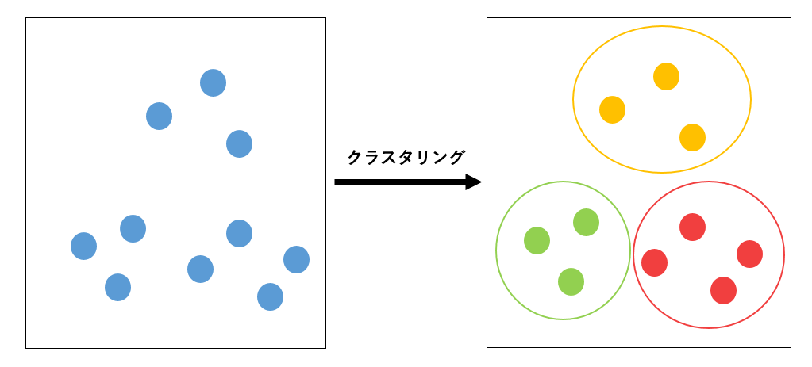
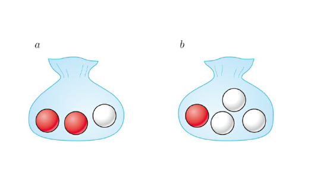

<!-- _class: first -->

# 「ベイズ推論による機械学習」輪読会

## 第 1 章: 機械学習とベイズ学習

### 正好 奏斗(@cosnomi)

---

## 目次 1

<!-- _class: outline -->

1. <strong>機械学習って何？</strong>

- 線形回帰
- 分類
- その他の機械学習

2. 確率の基本

- 確率分布・Bayes の定理
- 具体例 (2 つの袋の赤玉/白玉)
- 逐次推論

---

## 目次 2

<!-- _class: outline -->

3. グラフィカルモデル
4. ベイズ推論の導入

- 大まかな流れ
- 意思決定
- 利点・欠点

---

## 機械学習とは

- データの特徴を抽出する
- その特徴に基づいて未知の現象に対する予測を行う

- 特徴
  - 例えば「比例関係」「一次関数」など
  - 比例定数や切片を既知のデータから推測
    - このような値をパラメータという
  - 未知のデータ(x)が与えられたら y を予測できる
  - 実際はもっと複雑な関数

---

### ここからは具体的な機械学習について見ていきます

- 1 つ 1 つを詳しく理解する必要は無いと思います
- 全体を俯瞰するのがこの章の目的

---

## 線形回帰とは

- <strong>回帰(regression)</strong>とは $M$ 次元の入力$\bm{x} = (x_1, ..., x_M) \in \mathbb{R}^M$から$y\in \mathbb{R}$を求めること
- $M=1$なら$y=wx+b$とか ($y, w, x, b \in \mathbb{R}$)
- 既知のデータ
  - $\bm{x}$も$y$も分かっているデータ
- 未知のデータ
  - $\bm{x}$は分かるが、$y$が分からないので予測したい

---

## 線形回帰の式

- 一般化すると、
  $$y=w_1x_1+w_2x_2+\dots+w_Mx_M$$
- という式の$\bm{w} = (w_1, w_2, ..., w_M) \in \mathbb{R}^M$を既知のデータから求めたい
- ベクトルで書くと、
  $$y=\bm{w}^T\bm{x}$$
- 内積を転置で表していることに注意
  - $\bm{a}\cdot \bm{b} = \bm{a}^T\bm{b}$

---

- しかし既知のデータもすべて綺麗にこの式に従うわけではない
- 各サンプル(既知のデータのこと)の$n$番目について次のような式を考えられる
  $$ y_n = \bm{w}^T\bm{x}_n + \epsilon_n$$
- $\epsilon$が$n$番目のサンプルの<strong>誤差</strong>あるいは<strong>ノイズ</strong>を表している

  - 多くの場合、$\epsilon$は正規分布に従う(が、その話は後で)

- 切片は？2 次以上は考えられないの？
  - $\bm{x}=(1, x_1, {x_1}^2, x_2, {x_2}^2,...)$などとしてやれば良い
  - これはグラフだと曲線になるけど「線形回帰」という

---

## どうやって w を学習させるの？

- 詳しくはあとでやりますが…
- 代表的なのは最小二乗法
  - 既知のデータについて 2 乗誤差が最小になるような$\bm{w}$を求める
  - (しかし、これは「ベイズ的」ではない…)
  - (ベイズ推論はもっと面白い方法で良い$\bm{w}$を求める)

---

## 回帰から分類へ

- <strong>分類(classification)</strong>も機械学習においてよく出てくるタスク
  - $y \in \{0, 1\}$のように離散的な値を取る
  - 例えば 0 が陰性、1 が陽性みたいな
  - 多クラス(0: 陰性, 1: 軽症, 2: 重症みたいな)は後で
- 線形回帰では連続値$y$を予測した
  - 離散的な値はどう予測する？

---

## 連続値を確率とみなす

- 回帰で求めた値($\mu_n$とします)は実数全体を取りうるのでややこしい
- $f: \mathbb{R} \rightarrow (0,1)$みたいな関数によって$\mu_n$を$(0,1)$に移せれば簡単
- $\mu$を「クラス 1 に分類される確率」として考えられる
  - $f(\mu)\geq 0.5$なら$y_n=1$、そうでないなら$y_n=0$とすればよい
- どんな関数が良いだろう…

---

## Sigmoid function

- 有名な関数: <strong>シグモイド関数(sigmoid function)</strong>
  $$ \mathrm{Sig}(a) = \frac{1}{1+e^{-a}}$$
- $\sigma(a)$とか表記されることもある

---

## ここまでを数式でまとめる

- 今やりたいのは
  - 入力$\bm{x}_n=(x_1, x_2, ... x_M)$が与えられて
  - 出力$y_n \in \{0, 1\}$を求めたい
- 線形回帰
  $$ \mu_n = \bm{w}^T\bm{x_n}$$
- 既知のデータから良い感じの$\bm{w}$を求めて、未知のデータにも適用
- $\mathrm{Sig}(\mu_n)$をとって、0.5 以上なら 1、そうでないなら 0

---

## 多クラス分類

- 0: 陰性, 1: 軽症, 2: 重症 みたいな分類をしたい
- 非医学で言えば、手書き数字の認識(MNIST)などが有名
- 各クラスごとの確率を出す
  - 先ほどの例では、最終的な出力は「クラス 1 に分類される確率」
  - k クラス分類では出力を$k$次元として、$i (1 \leq i \leq k)$番目の成分が「クラス$i$に分類される確率」を表すことにする
  - 「ことにする」 = そのようにモデルを train する

---

## softmax 関数

$$ f_k(\bm{a}) = \mathrm{SM}_k(\bm{a}) = \frac{e^{a_k}}{\sum^K_{i=1} e^{a_i}} $$

- この f を softmax 関数という
- $\bm{a} \in \mathbb{R}^K$が線形回帰の出力で、$f_k(\bm{a})$はその値から、$k$番目のクラスの確率を表す値を求める関数
- $k$ について総和を取ると 1 になる (確率として都合の良い性質)
- sigmoid 関数の拡張
  - 2 変数の場合について softmax を計算して、式変形によって sigmoid 関数の形にしてみると分かる

---

## フォローしてますか？

- この章では全てを理解する必要はありませんが、
- なにか質問があればお願いします。
    
- ここからは定性的なざっくりとした話が続きます

---

## クラスタリング

- N 個のデータを K 個の集合に分ける
- 今までの分類タスクとの違いは？
  - クラスタリングは事前の学習をせず、いきなり未知のデータが与えられてそれを良い感じに分ける

---

## 線形次元削減 (動機)

- データが増えれば増えるほどより良い予測ができる？？
  - 次元が増えるほど学習が難しくなる
- 次元を減らしたい
  - 重要なデータを削ったらもちろん精度は落ちてしまう

つまり…

- 次元の重要度が高いものは残したい、低いものは消し去りたい
  - 高血圧のリスク予測に「塩分摂取量」は大事そうだけど、「使っている鉛筆の硬度」を入れても精度は上がらなそう

---

## 線形次元削減

元のデータ$\bm{Y} \in \mathbb{R}^{D\times N}$ を重み$\bm{W}\in \mathbb{R}^{M\times D}$と削減したデータ$\bm{X} \in \mathbb{R}^{M\times N} (M < D)$を用いて近似したい
$$\bm{Y} \approx \bm{W}^T\bm{X}$$

- $\bm{X}$ではなく$\bm{Y}$が元のデータ(既知)ということに注意が必要
- $\bm{X}$は$\bm{Y}$に含まれるデータの本質を抽出

---

- 線形回帰と式が似ている
- 注意: $\bm{Y}$の特徴量から重要なのを「選び取っている」のではなく、新しい特徴量を作っている

どうやって$\bm{W}$を求めるの？

- $\bm{Y}と\bm{W}^T\bm{X}$の誤差が最小になるようにとか
- ベイズ的な方法とか
- 詳しくは後の章で

---

## 他にもいろいろ機械学習 (余談)

- おすすめ商品
- 自動で質問に答える
- 人工的に画像を作り出す

などなど

---

## 機械学習の 2 つのアプローチ

- ツールボックス
  - 様々なアルゴリズムを試して性能を高めようとする
- モデリング
  - データの仮定・制約から数理的なモデルを構築 (モデリング)
    - このデータは正規分布に従うとか、ポアソン分布に従うとか
  - そのモデルのパラメータを推論によって求める (推論)
    - 正規分布なら平均・標準偏差

* ディープラーニングではツールボックス型が多いが、この本ではモデリングを扱う

---

<!-- _class: outline -->

- そもそも機械学習って何？
  - 具体的にはどんな種類・タスクがあるの？
- <strong>確率の基本</strong>
  - コインとか赤玉白玉とか
- ベイズ推論
  - ベイズの基本で重要な考え方
  - 事前分布・事後分布って何？

---

## 確率の基本

- いよいよ確率の基本に入っていきます
- 1 年生の頃にやっていたことなのですが、当然、忘れているので適宜復習しながら進めていきましょう。

---

## 離散と連続

- 離散: -3, 0, 1, 4,のように飛び飛びの値
- 連続: 実数全体を取る。0 と 1 の間にも無数の値が存在する

---

## 記法の復習

- $P(X=x)$: 確率変数$X$が$x$に等しくなる確率
- $P(X\leq x)$: 確率変数$X$が$x$以下になる確率
- $P(X=x, Y=y)$: 「確率変数$X$が$x$に等しく <strong>かつ</strong> 確率変数$Y$が$y$に等しい」確率
- $P(X=x|Y=y)$:「確率変数$Y$は$y$に等しい」ということが分かっている状況下での確率変数$X$が$x$に等しい確率

---

## 離散確率分布を表す確率質量関数

- 簡単に言うと、$p(x)$は$P(X=x)$を表す
- 性質(?)
  - $p(\bm{x}) \geq 0$
  - $\sum_{\bm{x}} p(\bm{x}) = \sum_{x_1} \cdots \sum_{x_M} p(x_1, ..., x_M) = 1$
- 逆にこれらの性質を満たすものを確率質量関数と定義する (後に出てくる連続型分布と対応させるため)

---

## 連続型確率分布(確率密度関数)

定義
関数$p: \bm{x} \in \mathbb{R}^M \rightarrow \mathbb{R}$で、$p(\bm{x}) \geq 0$かつ
$$ p(x) dx = \int \cdots \int p(x_1, \cdots x_M) dx_1\cdots dx_M = 1$$
となるもの

- 確率なんだから 0 以上で、全ての場合を足したら 1 になるべき
- 連続なので難しいけど、$\bm{x}$がちょうどその値を取ったときの確率

---

## 確率密度関数(1 変数関数の場合)

- 1 変数は去年?やった
  $$ P(X \leq x) = \int_{-\infty}^x p(t) dt$$

- 多変数でも雰囲気は同じ
- 勘違い
  - $p(t)$は$P(X=t)$と同じだ！→ 違います
  - 連続値なので面積で考える。ある 1 点のみの値はあまり確率的な意味合いを持たない

---

## 連続と離散をあわせて考える

結局、離散型確率分布の確率質量関数は、連続型確率分布の確率密度関数の積分(連続的な和)をシグマ(離散的な和)に変えただけです。

よって、今後の議論では積分を用いて連続型確率分布について考えますが、同様の議論が離散型確率分布にも適当可能です。

---

## 同時分布

- 2 つの変数$x, y$に対応する確率分布
  $$P(x \leq X, y \leq Y) = \int_{-\infty}^{x} \int_{-\infty}^{y} p(s, t) dt ds$$

---

## 周辺化

- <strong>周辺化</strong>: 一方の変数を除去する
  $$ p(y) = \int_{-\infty}^{\infty} p(x,y) dx$$
  - x かつ y の確率が全ての x, y について分かっている条件下で
  - $Y=y$の確率を知りたいなら、全ての$x$について、それらを足し合わせれば良い
- この$p(y)$を<strong>周辺分布</strong>という

---

## 条件付き分布

- $p(x|y)$のこと
  $$ p(x|y) = \frac{p(x,y)}{p(y)} $$
- これは$x$についての確率分布である
  - $y$の情報はパラメータとして作用し、$x$の分布の特性を決める
  - 詳しくは先でやりますが、「既知のデータ y が与えられたら、x の分布は元の$p(x)$からより妥当な$p(x|y)$に更新される」みたいな感じ

---

## Bayes の定理

$$ p(x|y) = \frac{p(y|x)p(x)}{p(y)} $$

- $p(y)$を両辺に掛ければ両辺が$p(x,y)$で等しくなる
- この式自体は割と当たり前のことを言ってるだけ
- しかし、ベイズ推論では$p(x|y)$を$p(y|x)$を使って表したいことが頻発するのでそういう意味で重要

---

## 独立性

- 「x と y が<strong>独立</strong>である」とは
  $$p(x,y) = p(x)p(y) $$
- あるいは、
  $$ p(x|y) = p(x) $$
- すなわち、$y$の情報が加わっても役に立たないということ

---

<!-- _class: outline -->

- そもそも機械学習って何？
  - 具体的にはどんな種類・タスクがあるの？
- 確率の基本
  - <strong>コインとか赤玉白玉とか</strong>
- ベイズ推論
  - ベイズの基本で重要な考え方
  - 事前分布・事後分布って何？

---

## 問題設定

状況: 2 つの袋 a, b があり、それぞれに赤と白の玉が入っている

- a には赤 2 コ, 白 1 コ
- b には赤 1 コ, 白 3 コ
  
  操作:

- まず 1/2 の確率で a, b の袋を選ぶ
- その後にその袋から玉を取り出す

---

## 袋の選択

- 袋 a が選ばれることを$x=a$, 袋 b が選ばれることを$x=b$とすると、
  $$ p(x=a) = \frac{1}{2}, p(x=b) = \frac{1}{2}$$

---

## 赤白玉の選択

- 赤玉が取り出されることを$y=r$, 白玉を$y=w$
  
- 袋 a が選ばれたとき、
  - $p(y=r | x=a) = 2/3$
  - $p(y=w | x=a) = 1/3$
- 袋 b が選ばれたとき、
  - $p(y=r | x=b) = 1/4$
  - $p(y=w | x=b) = 3/4$

---

## 同時分布を求める

$p(x, y) = p(y|x)p(x)$が使える
袋 a を選択し、かつ、赤玉を取り出す確率は、
$$\begin{aligned}p(x=a, y=r) &= p(y=r | x=a)p(x=a) \\ &= \frac{1}{4} \times \frac{1}{2} = \frac{1}{8}\end{aligned}$$

- これを求めること自体は簡単だと思いますが、今回の内容である「<strong>同時分布</strong>」「<strong>条件付き分布</strong>」といった概念と関連付けていきましょう！

---

## 周辺分布を求める

- 周辺分布？→$p(x,y)$をすべての$x$について足し合わせて$p(y)$に
- 「選んだ袋に関わらず赤 or 白玉が出る確率」を求めることに相当
  $$ p(y=r) = \sum_x p(y=r, x) = 1/3+1/8=11/24$$
- 離散なのでシグマを使ったが、連続なら$\int$を使う
- $p(y=r, x)$は$p(y=r, x=x)$と考えると分かりやすいかも

---

## Bayes の定理を使う

メインテーマ！

- <strong>Bayes の定理</strong>は$p(y|x)$を$p(x|y)$を用いて表せる
- 取り出した玉が分かっているとき、それを袋 a または b から取り出した確率を求められる
  $$ p(x=a|y=r) = \frac{p(y=r|x=a)p(x=a)}{p(y=r)} = 8/11$$
- 本当は袋を選んでから玉を取り出したのに、玉が先に分かっていて袋の確率を求めている → <strong>時間を逆行している</strong>

---

## 事前分布と事後分布

- 原因(選んだ袋)→ 結果(取り出した玉)
- Bayes の定理より、結果から原因の確率を計算できた
  - <strong>事後分布</strong>: 結果が観測された後の分布 $p(x|y)$
  - <strong>事前分布</strong>: 結果が観測される前の分布 $p(x)$
- 事前分布にトレーニングデータを与えて事後分布を求める

---

## もっと多くの玉を取り出してみようｌ
