<!-- _class: first -->

# 「ベイズ推論による機械学習」輪読会

## 第 1 章: 機械学習とベイズ学習

### 正好 奏斗(@cosnomi)

---

## 目次 1

<!-- _class: outline -->

1. <strong>機械学習って何？</strong>

- 線形回帰
- 分類
- その他の機械学習

2. 確率の基本

- 確率分布・Bayes の定理
- 具体例 (2 つの袋の赤玉/白玉)
- 逐次推論

---

## 目次 2

<!-- _class: outline -->

3. グラフィカルモデル
4. ベイズ推論の導入

- 大まかな流れ
  - 線形回帰
  - クラスタリング
- 意思決定
- 利点・欠点

---

## 機械学習とは

- データの<strong>特徴</strong>を抽出する
- その特徴に基づいて未知の現象に対する予測を行う

- 「特徴」って何？
  - 例えば「比例関係」「一次関数」など
  - 比例定数や切片を既知のデータから推測
    - このような値をパラメータという
  - 未知のデータ(x)が与えられたら y を予測できる

---

### ここからは具体的な機械学習について見ていきます

- 1 つ 1 つを詳しく理解する必要は無いと思います
- 全体を俯瞰するのがこの章の目的

---

## 目次 1

<!-- _class: outline -->

1. 機械学習って何？

- <strong>線形回帰</strong>
- 分類
- その他の機械学習

2. 確率の基本

- 確率分布・Bayes の定理
- 具体例 (2 つの袋の赤玉/白玉)
- 逐次推論

---

## 線形回帰とは

- <strong>回帰(regression)</strong>: $M$ 次元の入力$\bm{x} = (x_1, ..., x_M) \in \mathbb{R}^M$から$y\in \mathbb{R}$を求めること
- $M=1$なら$y=wx$とか ($y, w, x \in \mathbb{R}$)
- 既知のデータとは
  - $\bm{x}$も$y$も分かっているデータ
- 未知のデータとは
  - $\bm{x}$は分かるが、$y$が分からないので予測したい

---

## 線形回帰の式

- 一般化すると、
  $$y=w_1x_1+w_2x_2+\dots+w_Mx_M$$
- という式の$\bm{w} = (w_1, w_2, ..., w_M) \in \mathbb{R}^M$を既知のデータから求めたい
- ベクトルで書くと、
  $$y=\bm{w}^T\bm{x}$$
- 内積を転置で表していることに注意
  - $\bm{a}\cdot \bm{b} = \bm{a}^T\bm{b}$

---

- しかし既知のデータもすべて綺麗にこの式に従うわけではない
- 各サンプル(既知のデータのこと)の$n$番目について次のような式を考えられる
  $$ y_n = \bm{w}^T\bm{x}_n + \epsilon_n$$
- $\epsilon$が$n$番目のサンプルの<strong>誤差</strong>あるいは<strong>ノイズ</strong>を表している

- 切片は？2 次以上は考えられないの？
  - $\bm{x}=(1, x_1, {x_1}^2, x_2, {x_2}^2,...)$などとしてやれば良い
  - これはグラフだと曲線になるけど「線形回帰」という

---

## どうやって w を学習させるの？

- 詳しくはあとでやりますが…
- 代表的なのは最小二乗法
  - 既知のデータについて 2 乗誤差が最小になるような$\bm{w}$を求める
  - (しかし、これは「ベイズ的」ではない…)
  - (ベイズ推論はもっと面白い方法で良い$\bm{w}$を求める)

---

## 目次 1

<!-- _class: outline -->

1. 機械学習って何？

- 線形回帰
- <strong>分類</strong>
- その他の機械学習

2. 確率の基本

- 確率分布・Bayes の定理
- 具体例 (2 つの袋の赤玉/白玉)
- 逐次推論

---

## 回帰から分類へ

- <strong>分類(classification)</strong>も機械学習においてよく出てくるタスク
  - $y \in \{0, 1\}$のように離散的な値を取る
  - 例えば 0 が陰性、1 が陽性みたいな
  - 多クラス(0: 陰性, 1: 軽症, 2: 重症みたいな)は後で
- 線形回帰では連続値$y$を予測した
  - 離散的な値はどう予測する？

---

## 連続値を確率とみなす

- 回帰で求めた値($\mu_n$とします)は実数全体を取りうるのでややこしい
- $f: \mathbb{R} \rightarrow (0,1)$みたいな関数によって$\mu_n$を$(0,1)$に移せれば簡単
- $\mu$を「クラス 1 に分類される確率」として考えられる
  - $f(\mu)\geq 0.5$なら$y_n=1$、そうでないなら$y_n=0$とすればよい
- どんな関数が良いだろう…

---

## Sigmoid function

- 有名な関数: <strong>シグモイド関数(sigmoid function)</strong>
  $$ \mathrm{Sig}(a) = \frac{1}{1+e^{-a}}$$
- $\sigma(a)$とか表記されることもある

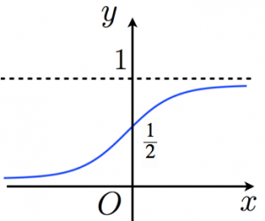

---

## ここまでを数式でまとめる

- 今やりたいのは
  - 入力$\bm{x}_n=(x_1, x_2, ... x_M)$が与えられて
  - 出力$y_n \in \{0, 1\}$を求めたい
- 線形回帰により$\mu_n$を求める
  $$ \mu_n = \bm{w}^T\bm{x_n}$$
- 既知のデータから良い感じの$\bm{w}$を求めて、未知のデータにも適用
- $\mathrm{Sig}(\mu_n)$をとって、0.5 以上なら 1、そうでないなら 0

---

## 多クラス分類

- 0: 陰性, 1: 軽症, 2: 重症 みたいな分類をしたい
- 非医学で言えば、手書き数字の認識(MNIST)などが有名
- 各クラスごとの確率を出す
  - 先ほどの例では、最終的な出力は「クラス 1 に分類される確率」
  - k クラス分類では出力を$k$次元として、$i (1 \leq i \leq k)$番目の成分が「クラス$i$に分類される確率」を表すことにする
  - 「ことにする」 = そのようにモデルを train する

---

## softmax 関数

$$ f_k(\bm{a}) = \mathrm{SM}_k(\bm{a}) = \frac{e^{a_k}}{\sum^K_{i=1} e^{a_i}} $$

- この f を softmax 関数という
- $\bm{a} \in \mathbb{R}^K$が線形回帰の出力で、$f_k(\bm{a})$はその値から、$k$番目のクラスの確率を表す値を求める関数
- $k$ について総和を取ると 1 になる (確率として都合の良い性質)
- sigmoid 関数の拡張
  - 2 変数の場合について softmax を計算して、式変形によって sigmoid 関数の形にしてみると分かる

---

## フォローしてますか？

- この章では全てを理解する必要はありませんが、
- なにか質問があればお願いします。
    
- ここからは定性的なざっくりとした話が続きます

---

## 目次 1

<!-- _class: outline -->

1. 機械学習って何？

- 線形回帰
- 分類
- <strong>その他の機械学習</strong>

2. 確率の基本

- 確率分布・Bayes の定理
- 具体例 (2 つの袋の赤玉/白玉)
- 逐次推論

---

## クラスタリング

- N 個のデータを K 個の集合に分ける
- 今までの分類タスクとの違いは？
  - クラスタリングは事前の学習をせず、<strong>いきなり未知のデータが与えられ</strong>てそれを良い感じに分ける(教師なし学習)

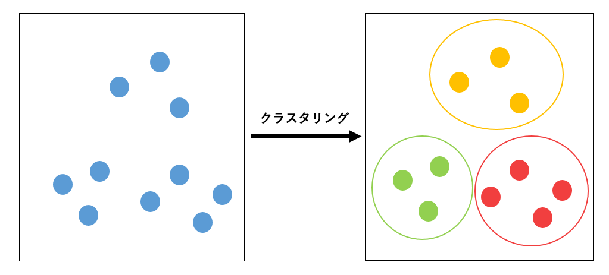

---

## 線形次元削減 (動機)

- データが増えれば増えるほどより良い予測ができる？？
  - 次元が増えるほど学習が難しくなる (<strong>次元の呪い</strong>)
- 次元を減らしたい
  - けど、重要なデータを削ったらもちろん精度は落ちてしまう

つまり…

- 次元の<strong>重要度が高いものは残したい、低いものは消し去りたい</strong>
  - 高血圧のリスク予測に「塩分摂取量」は大事そうだけど、「使っている鉛筆の硬度」を入れても精度は上がらなそう

---

## 線形次元削減

元のデータ$\bm{Y} \in \mathbb{R}^{D\times N}$ を重み$\bm{W}\in \mathbb{R}^{M\times D}$と削減したデータ$\bm{X} \in \mathbb{R}^{M\times N} (M < D)$を用いて近似したい
$$\bm{Y} \approx \bm{W}^T\bm{X}$$

- $\bm{X}$ではなく$\bm{Y}$が元のデータ(既知)ということに注意が必要
- $\bm{X}$は$\bm{Y}$に含まれるデータの本質を抽出

---

- 線形回帰と式が似ている
- 注意: $\bm{Y}$の特徴量から重要なのを「選び取っている」のではなく、新しい特徴量を作っている

どうやって$\bm{W}$を求めるの？

- $\bm{Y}$と$\bm{W}^T\bm{X}$の誤差が最小になるようにとか
- ベイズ的な方法とか
- 詳しくは後の章で

---

## 他にもいろいろ機械学習 (余談)

- おすすめ商品
- 自動で質問に答える
- 人工的に画像を作り出す

などなど

---

## 機械学習の 2 つのアプローチ

- ツールボックス
  - 様々なアルゴリズムを試して性能を高めようとする
- モデリング
  - データの仮定・制約から数理的なモデルを構築 (モデリング)
    - このデータは正規分布に従うとか、ポアソン分布に従うとか
  - そのモデルのパラメータを推論によって求める (推論)
    - 正規分布なら平均・標準偏差

* ディープラーニングではツールボックス型が多いが、この本ではモデリングを扱う

---

## 目次 1

<!-- _class: outline -->

1. 機械学習って何？

- 線形回帰
- 分類
- その他の機械学習

2. <strong>確率の基本</strong>

- 確率分布・Bayes の定理
- 具体例 (2 つの袋の赤玉/白玉)
- 逐次推論

---

## 確率の基本

- いよいよ確率の基本に入っていきます
- 1 年生の頃にやっていたことなのですが、当然、忘れているので適宜復習しながら進めていきましょう。

---

## 離散と連続

- 離散: -3, 0, 1, 4,のように飛び飛びの値
- 連続: 実数全体を取る。0 と 1 の間にも無数の値が存在する

---

## 記法の復習

- $P(X=x)$: 確率変数$X$が$x$に等しくなる確率
- $P(X\leq x)$: 確率変数$X$が$x$以下になる確率
- $P(X=x, Y=y)$: 「確率変数$X$が$x$に等しく <strong>かつ</strong> 確率変数$Y$が$y$に等しい」確率
- $P(X=x|Y=y)$:「確率変数$Y$は$y$に等しい」ということが<strong>分かっている状況下での</strong>確率変数$X$が$x$に等しい確率

---

## 目次 1

<!-- _class: outline -->

1. 機械学習って何？

- 線形回帰
- 分類
- その他の機械学習

2. 確率の基本

- <strong>確率分布・Bayes の定理</strong>
- 具体例 (2 つの袋の赤玉/白玉)
- 逐次推論

---

## 離散確率分布を表す確率質量関数

- 簡単に言うと、$p(x)$は$P(X=x)$を表す
- 性質(?)
  - $p(\bm{x}) \geq 0$
  - $\sum_{\bm{x}} p(\bm{x}) = \sum_{x_1} \cdots \sum_{x_M} p(x_1, ..., x_M) = 1$
- 逆にこれらの性質を満たすものを<strong>確率質量関数</strong>と定義する (後に出てくる連続型分布と対応させるため)

---

## 連続型確率分布(確率密度関数)

定義
関数$p: \bm{x} \in \mathbb{R}^M \rightarrow \mathbb{R}$で、$p(\bm{x}) \geq 0$かつ
$$ p(x) dx = \int \cdots \int p(x_1, \cdots x_M) dx_1\cdots dx_M = 1$$
となるもの

- 確率なんだから 0 以上で、全ての場合を足したら 1 になるべき
- 連続なので難しいけど、$\bm{x}$がちょうどその値を取ったときの確率

---

## 確率密度関数(1 変数関数の場合)

- 1 変数は去年?やった
  $$ P(X \leq x) = \int_{-\infty}^x p(t) dt$$

- 多変数でも雰囲気は同じ
- 勘違い
  - $p(t)$は$P(X=t)$と同じだ！→ 違います
  - 連続値なので<strong>面積で考える</strong>。ある 1 点のみの値はあまり確率的な意味合いを持たない

---

## 連続と離散をあわせて考える

結局、離散型確率分布の確率質量関数は、連続型確率分布の確率密度関数の積分(<strong>連続的な和</strong>)をシグマ(<strong>離散的な和</strong>)に変えただけです。

よって、今後の議論では積分を用いて連続型確率分布について考えますが、同様の議論が離散型確率分布にも適当可能です。

---

## 同時分布

- 2 つの変数$x, y$に対応する確率分布
  $$P(x \leq X, y \leq Y) = \int_{-\infty}^{x} \int_{-\infty}^{y} p(s, t) dt ds$$

---

## 周辺化

- <strong>周辺化</strong>: 一方の変数を除去する
  $$ p(y) = \int_{-\infty}^{\infty} p(x,y) dx$$
  - x かつ y の確率が全ての x, y について分かっている条件下で
  - $Y=y$の確率を知りたいなら、全ての$x$について、それらを足し合わせれば良い
- この$p(y)$を<strong>周辺分布</strong>という

---

## 条件付き分布

- $p(x|y)$のこと
  $$ p(x|y) = \frac{p(x,y)}{p(y)} $$
- これは$x$についての確率分布である
  - $y$の情報はパラメータとして作用し、$x$の分布の特性を決める
  - 詳しくは先でやりますが、「既知のデータ y が与えられたら、x の分布は元の$p(x)$からより妥当な$p(x|y)$に更新される」みたいな感じ

---

## Bayes の定理

$$ p(x|y) = \frac{p(y|x)p(x)}{p(y)} $$

- $p(y)$を両辺に掛ければ両辺が$p(x,y)$で等しくなる
- この式自体は割と当たり前のことを言ってるだけ
- しかし、ベイズ推論では$p(x|y)$を$p(y|x)$を使って表したいことが頻発するのでそういう意味で重要

---

## 独立性

- 「x と y が<strong>独立</strong>である」とは
  $$p(x,y) = p(x)p(y) $$
- あるいは、
  $$ p(x|y) = p(x) $$
- すなわち、$y$の情報が加わっても役に立たないということ

---

## 目次 1

<!-- _class: outline -->

1. 機械学習って何？

- 線形回帰
- 分類
- その他の機械学習

2. 確率の基本

- 確率分布・Bayes の定理
- <strong>具体例 (2 つの袋の赤玉/白玉)</strong>
- 逐次推論

---

## 問題設定

状況: 2 つの袋 a, b があり、それぞれに赤と白の玉が入っている

- a には赤 2 コ, 白 1 コ
- b には赤 1 コ, 白 3 コ
  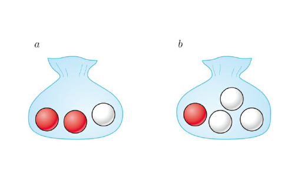
  操作:

- まず 1/2 の確率で a, b の袋を選ぶ
- その後にその袋から玉を取り出す

---

## 袋の選択

- 袋 a が選ばれることを$x=a$, 袋 b が選ばれることを$x=b$とすると、
  $$ p(x=a) = \frac{1}{2}, p(x=b) = \frac{1}{2}$$

---

## 赤白玉の選択

- 赤玉が取り出されることを$y=r$, 白玉を$y=w$
  
- 袋 a が選ばれたとき、
  - $p(y=r | x=a) = 2/3$
  - $p(y=w | x=a) = 1/3$
- 袋 b が選ばれたとき、
  - $p(y=r | x=b) = 1/4$
  - $p(y=w | x=b) = 3/4$

---

## 同時分布を求める

$p(x, y) = p(y|x)p(x)$が使える
袋 a を選択し、かつ、赤玉を取り出す確率は、
$$\begin{aligned}p(x=a, y=r) &= p(y=r | x=a)p(x=a) \\ &= \frac{1}{4} \times \frac{1}{2} = \frac{1}{8}\end{aligned}$$

- これを求めること自体は簡単だと思いますが、今回の内容である「<strong>同時分布</strong>」「<strong>条件付き分布</strong>」といった概念と関連付けていきましょう！

---

## 周辺分布を求める

- 周辺分布？→$p(x,y)$をすべての$x$について足し合わせて$p(y)$に
- 「選んだ袋に関わらず赤 or 白玉が出る確率」を求めることに相当
  $$ p(y=r) = \sum_x p(y=r, x) = 1/3+1/8=11/24$$
- 離散なのでシグマを使ったが、連続なら$\int$を使う
- $p(y=r, x)$は$p(y=r, x=x)$と考えると分かりやすいかも

---

## Bayes の定理を使う

メインテーマ！

- <strong>Bayes の定理</strong>は$p(y|x)$を$p(x|y)$を用いて表せる
- 取り出した玉が分かっているとき、それを袋 a または b から取り出した確率を求められる
  $$ p(x=a|y=r) = \frac{p(y=r|x=a)p(x=a)}{p(y=r)} = 8/11$$
- 本当は袋を選んでから玉を取り出したのに、玉が先に分かっていて袋の確率を求めている → <strong>時間を逆行している</strong>

---

## 事前分布と事後分布

- 原因(選んだ袋)→ 結果(取り出した玉)
- Bayes の定理より、結果から原因の確率を計算できた
  - <strong>事後分布</strong>: 結果が観測された後の分布 $p(x|y)$
  - <strong>事前分布</strong>: 結果が観測される前の分布 $p(x)$
- 事前分布にトレーニングデータを与えて事後分布を求める

---

## 目次 1

<!-- _class: outline -->

1. 機械学習って何？

- 線形回帰
- 分類
- その他の機械学習

2. 確率の基本

- 確率分布・Bayes の定理
- 具体例 (2 つの袋の赤玉/白玉)
- <strong>逐次推論</strong>

---

## もっと多くの玉を取り出してみよう(1)

- 袋 a/b がわからない状態で、玉を取り出し、その結果から袋 a/b それぞれの確率を推定した
- 複数回取り出して戻す(復元抽出)すれば、より確からしい推論ができそう
- $\{y_1, y_2, y_3\} = \{r, r, w\}$という結果が得られたとする
- 求めたいのは、$p(x|y_1=r, y_2=r, y_3=w)$
- 復元抽出は独立なので、
  $$p(y_1=r, y_2=r, y_3=w|x) = p(y_1=r|x)p(y_2=r|x)p(y_3=w|x)$$

---

## もっと多くの玉を取り出してみよう(2)

- Bayes の定理より
  $$\begin{aligned}p(x|y_1=r, y_2=r, y_3=w) &= \frac{p(y_1=r, y_2=r, y_3=w|x)p(x)}{p(y_1=r, y_2=r, y_3=w)} \\ &= \frac{p(y_1=r|x)p(y_2=r|x)p(y_3=w|x)p(x)}{p(y_1=r, y_2=r, y_3=w)}\end{aligned}$$

- ここで分母の計算が面倒 (周辺化を行う必要がある)
- $p(x|y_1=r, y_2=r, y_3=w)$は$x$のすべての場合について足し合わせると 1 になるので、分子のみを計算して<strong>後で合計が 1 になるように調整する</strong> ← 今後、頻出するテクです

---

## もっと多くの玉を取り出してみよう(3)

- $x=a$について
  $$ p(x=a|y_1=r, y_2=r, y_3=w) \propto p(y_1=r|x=a)p(y_2=r|x=a)p(y_3=w|x=a)p(x=a) $$
- $\propto$は比例するという意味。分母を省略しているため。
- 計算略: $x=a$については、$2/27$, $x=b$について$3/128$を得ます。(式(1.42), (1.43))
- 足して 1 になるように正規化する
  $$ p(x=a|y_1=r, y_2=r, y_3=w) =\frac{2/27}{2/27+3/128}=\frac{256}{337}$$

---

## 逐次推論

このように複数の<strong>独立なデータ</strong>があれば、より確からしい推論を<strong>逐次的</strong>に行える。

- 1 つの観測値$y_1$を得たとする。事後分布は、
  $$p(x|y_1)\propto p(y_1|x)p(x)$$
- さらにもう 1 つ$y_2$を得たとする
  $$\begin{aligned}p(x|y_1, y_2) &\propto p(y_1, y_2 | x)p(x) \\ &= p(y_2 | x)p(y_1|x)p(x) \\ &\propto p(y_2|x)p(x|y_1)\end{aligned}$$

---

<!-- TODO: 余裕があればパラメータ推定の話をここに入れる-->

## 目次 2

<!-- _class: outline -->

3. <strong>グラフィカルモデル</strong>
4. ベイズ推論の導入

- 大まかな流れ
  - 線形回帰
  - クラスタリング
- 意思決定
- 利点・欠点

---

## グラフィカルモデル

- モデルに出てくる変数を視覚的に理解したい
  - 数式だと条件付き分布やその積がたくさん出てきて大変
- 例えば先程の例だと$p(x,y) = p(y|x)p(x)$
  
- 各変数(x, y)が頂点になっている
- 辺(矢印)は条件付き分布を表す
  - y の分布は x に依存している
- グラフの構造は DAG(有向非巡回グラフ): 向きがあってループなし

---

## 例

$$p(x_1,x_2,x_3,x_4,x_5,x_6) = p(x_2|x_1)p(x_3|x_1)p(x_4|x_2, x_3)p(x_5|x_2, x_3)p(x_6|x_4, x_5)$$

- グラフィカルモデル (ループが存在しないことも注意)
  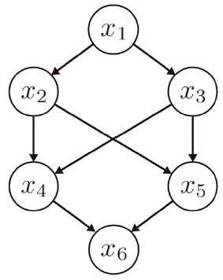

---

## 繰り返し(プレート表現)

- n 個の変数が存在するときなどに使える
- 先程の逐次推論の例では、N 回の復元抽出を行った。その全ては「袋の選択」x に依存していた。
  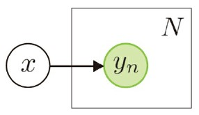

---

## いろいろなグラフィカルモデル

- 条件付き分布の関係を視覚的に表現する道具を手に入れた
- 条件付けのタイプをグラフィカルモデルとともに見ていく
  - head-to-tail 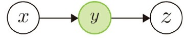
  - tail-to-tail 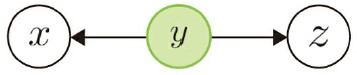
  - head-to-head 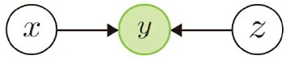
- $y$が観測されているとして、$x$や$z$の事後分布を考える

---

## head-to-tail

- 式は$p(x,y,z) = p(x)p(y|x)p(z|y)$
  事後分布は？
  $$ \begin{aligned}p(x,z|y) &= \frac{p(x,y,z)}{p(y)}  &= p(x|y)p(z|y)\end{aligned} $$

- もともと $x$ と $z$ の間にあった関係は $y$ が与えられたことで消えて、$x$ と $z$ は独立になった
  - 事後分布が独立に分解できる →<strong>条件付き独立性</strong>

---

## tail-to-tail

- 式は$p(x,y,z) = p(x|y)p(y)p(z|y)$
  事後分布は？
  $$ \begin{aligned}p(x,z|y) &= \frac{p(x,y,z)}{p(y)}  &= p(x|y)p(z|y)\end{aligned} $$
- $x$ と $y$ は条件付き独立

---

## head-to-head

- 式は$p(x,y,z) = p(x)p(y|x,z)p(z)$
- もともと $x$ と $z$ は独立
- 事後分布は？
  $$ \begin{aligned}p(x,z|y) &= \frac{p(x,y,z)}{p(y)}  &= \frac{p(x)p(y|x,z)p(z)}{p(y)} \end{aligned} $$
- 条件付き独立にならない
  - $y$の観測によって、$x$と$z$に依存関係が生じてしまった

---

## マルコフブランケット

TODO: 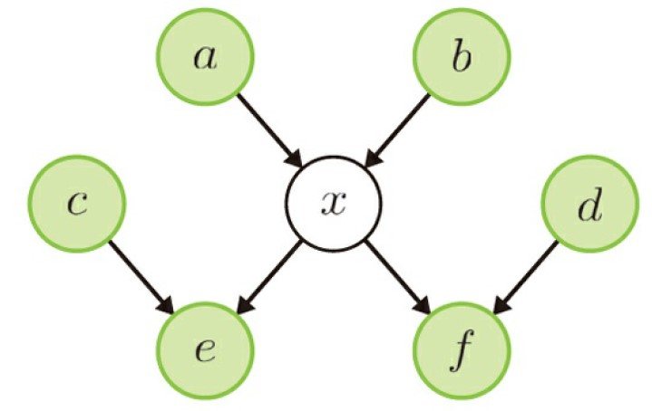

---

## 目次 2

<!-- _class: outline -->

3. グラフィカルモデル
4. ベイズ推論の導入

- <strong>大まかな流れ</strong>
  - 線形回帰
  - クラスタリング
- 意思決定
- 利点・欠点

---

## ベイズ学習の基本

1. 観測データ$D$と未知の変数$\bm{X}$に関して同時分布$p(D,\bm{X})$を構築
   - $\bm{X}$はモデルパラメータ
   - 例えば$D$に正規分布を仮定したなら、$\bm{X}$は$(m, \sigma)$とか
2. 事後分布の計算
   $$ p(X|D) = \frac{p(D|X)p(X)}{p(D)} $$
   - これは解析的に求められることもあるし、近似的に求めることも
   - $p(D)$の計算が難しい (X について周辺化しなければならない)

---

## 目次 2

<!-- _class: outline -->

3. グラフィカルモデル
4. ベイズ推論の導入

- 大まかな流れ
  - <strong>線形回帰</strong>
  - クラスタリング
- 意思決定
- 利点・欠点

---

## 線形回帰でベイズを使ってみよう

- 具体的に「正規分布が～」などの話は抜きにして概略のみ
- 復習: $y_n = \bm{w}^T\bm{x}_n + \bm{b}_n$
- 今は、「サンプルごとの$\bm{x}_n$と共通の$\bm{w}$でサンプルごとの$y_n$が決まる」ことが大事
- 「誤差が正規分布に従うと仮定してー」などの話は具体的な分布について扱ってからの話

---

## step1: 同時分布を構築する

$$P(\bm{Y}, \bm{X}, \bm{w}) = p(\bm{w}) \prod_{n=1}^N p(y_n|\bm{x}_n, \bm{w})p(\bm{x}_n) $$
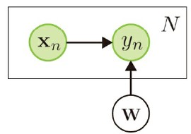

- $\bm{Y}$や$\bm{X}$は$N$個のサンプルをまとめた行列

---

## 事後分布を求める

$$ \begin{aligned} p(\bm{w}|\bm{Y}, \bm{X}) &=\frac{p(\bm{Y}, \bm{X}|\bm{w})p(\bm{w})}{p(\bm{Y}, \bm{X})} \\ &= \frac{p(\bm{Y} | \bm{X}, \bm{w})p(\bm{X})p(\bm{w})}{p(\bm{Y}|\bm{X}) p(\bm{X})} \\ &\propto p(\bm{w})\prod_{n=1}^Np(y_n|\bm{x}_n, \bm{w}) \end{aligned}$$

- 途中で$\bm{x}$と$\bm{w}$が独立であることを用いた

---

## 未知のデータに対する予測

- 未知の入力を$x_*$それに対応する予測出力を$y_*$とする。
  $$ p(y_* | x_*, \bm{Y}, \bm{X}) = \int {p(y_*|x_*, \bm{w})p(\bm{w}|\bm{Y}, \bm{X}) dw} $$
- 既知のデータ$\bm{Y}, \bm{X}$を用いて学習されたパラメータ$\bm{w}$の分布を用いて、未知の入力$x_*$に対して期待される出力$y_*$を求める
- 重要: <strong>パラメータ$w$を 1 つの値に決めるのではなく、その事後分布$p(\bm{w} | \bm{Y}, \bm{X})$を求めて(学習して)周辺化するところがベイズ的</strong>

---

## 目次 2

<!-- _class: outline -->

3. グラフィカルモデル
4. ベイズ推論の導入

- 大まかな流れ
  - 線形回帰
  - <strong>クラスタリング</strong>
- 意思決定
- 利点・欠点

---

## クラスタリング

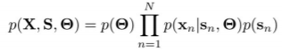

- $\bm{X}=\{\bm{x}_1, ..., \bm{x}_n\}$: 観測データ
- $\bm{S}=\{\bm{s}_1, ..., \bm{s}_n\}$: クラスタの割り当て方
- $\bm{\Theta}=\{\bm{\theta_1}\, ..., \bm{\theta_k}\}$: 各クラスタの性質
  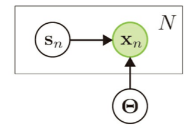

---

## 近似

- 事後分布の計算において、周辺化を伴う$p(D)$の計算は計算量的に難しい
- サンプリング
  - MCMC
  - ギブズサンプリング
- 変分推論

---

## 目次 2

<!-- _class: outline -->

3. グラフィカルモデル
4. ベイズ推論の導入

- 大まかな流れ
  - 線形回帰
  - クラスタリング
- 意思決定
- <strong>利点・欠点</strong>

---

## ベイズ推論の利点

- 一貫性のあるアプローチ
  - ディープラーニングでは、このタスクにはこっちのモデルがいいけど、別なタスクには応用できないみたいなこともある
- ドメイン知識の導入が容易
  - 医療者としての知識を確率モデルに反映
- 過剰適合しにくい
  - 事前分布に強い仮定を置いている
  - 「学習」は分布を更新しているだけ

---

## ベイズ推論の欠点

- 数学が難しい
  - その分、数学的な根拠がしっかりしている
- 計算コスト
  - ディープラーニングも大概だけど

---

## 第 2 章では…

- 具体的な確率分布について見ていきます
  - 事後分布や周辺分布の計算を具体的にできるようになります
  - モデル選択は実際にデータ解析を行う上で非常に重要です

相談:

- 計算多めですが、どの深さまで追うべきでしょうか
- 担当はどうしますか / LT?
- 次回日程
- メンバー
