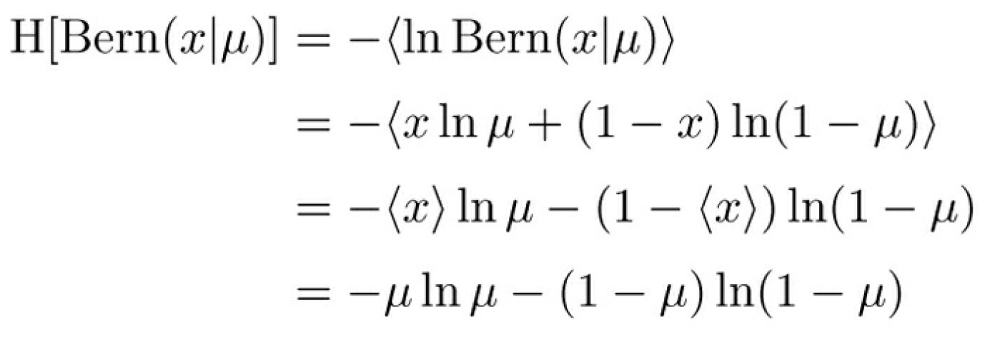
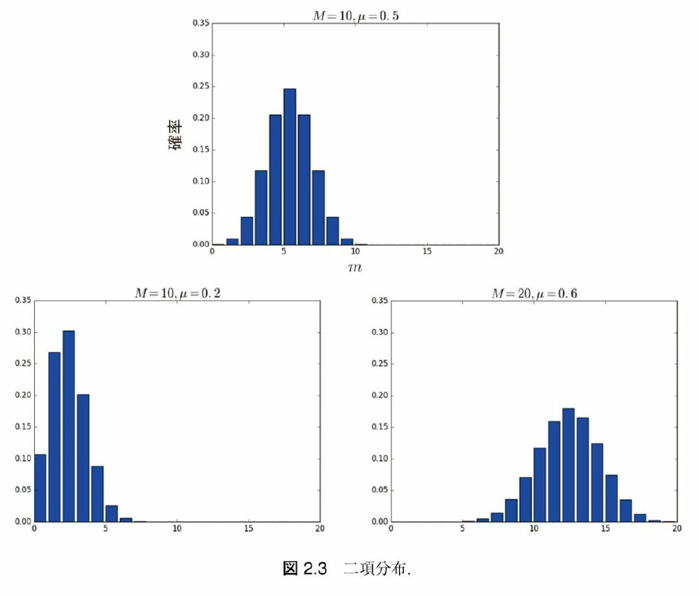
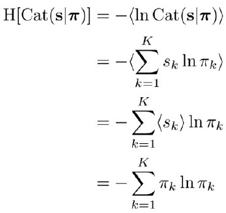
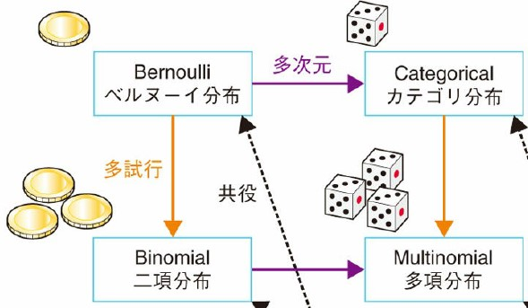
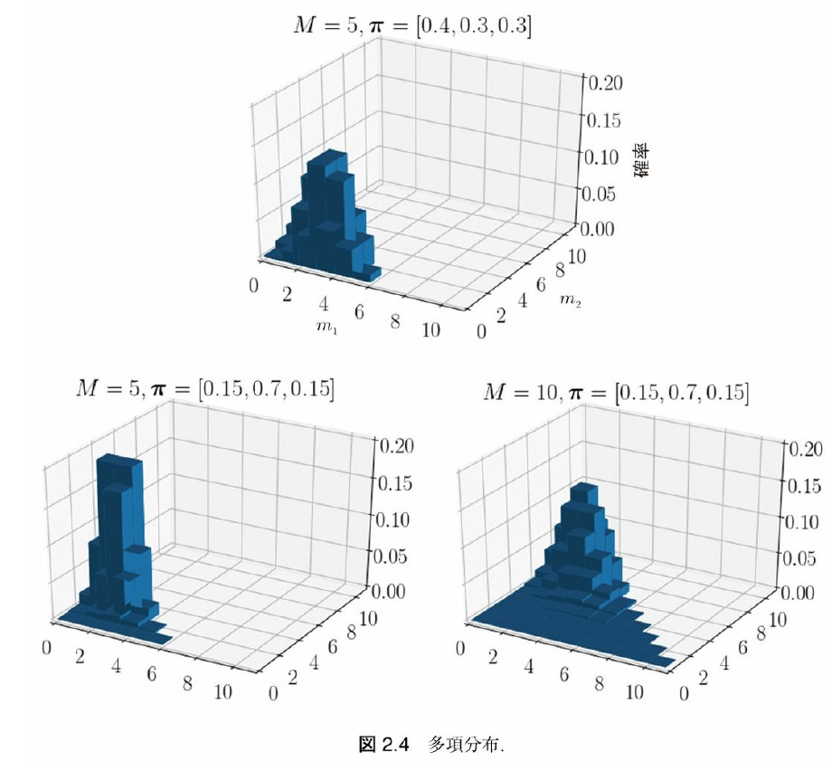
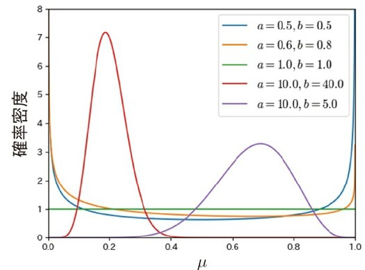
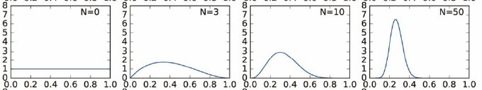
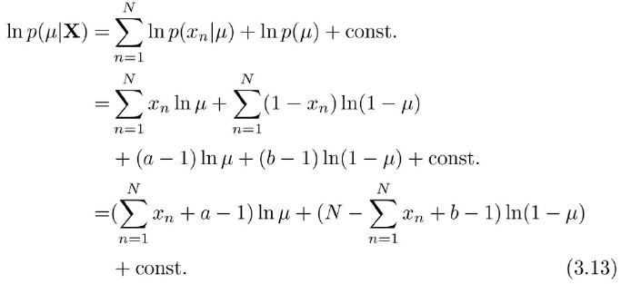

<!-- _class: first -->

# 「ベイズ推論による機械学習」勉強会 (2)

## 第 2 章: 基本的な確率分布 (連続型確率分布のうちベータ分布以外を除く) / 第 3 章: ベイズ推論による学習と予測 (ベルヌーイ分布に対する推論)

### 正好 奏斗(@cosnomi)

---

## この章について

- まず確率分布に対して定義される値(期待値など)を学びます
- 離散・連続型確率分布について、その定義と性質を見ていきます
  - 多いです
  - 各分布における期待値などを ~~一応導出します~~(長すぎるので一部省略) が、実務上は計算済みの表を見たほうが速いと思います
  - 実際の式・計算より「**分布が何を表す(いつ使える)のか**」「分布の**パラメータ**は何か」が大事
    - 今後、推論に入っていくときに使う
- 分布紹介だけではつまらないので最後にベイズ推論を 1 つ

---

## 目次 1

<!-- _class: outline -->

1. 確率分布に関連する値
2. 離散確率分布
   1. ベルヌーイ分布
   2. 二項分布
   3. カテゴリ分布
   4. 多項分布
   5. 4 つの分布の関係
   6. ポアソン分布

---

## 目次 2

<!-- _class: outline -->

3. 連続型確率分布
   1. ベータ分布
   2. ~~ディレクレ分布~~
   3. ~~ガンマ分布~~
   4. ~~1 次元ガウス分布(正規分布)~~
   5. ~~多次元ガウス分布~~
   6. ~~ウィシャート分布~~
4. ベルヌーイ分布を用いたベイズ推論 ← 少し変えました

---

## 期待値

- 定義

  - $\bm{x}$をベクトル、$p(\bm{x})$を確率分布、$f(\bm{x})$を$\bm{x}$に対して定義される関数とする。$p(\bm{x})$に対する$f(\bm{x})$の期待値は
    $$ \langle f(\bm{x}) \rangle _{p(\bm{x})} = \int f(\bm{x})p(\bm{x}) dx $$

- ここでは$\bm{x}$をベクトルとしているけど、スカラーのほうが身近
- 右下の$p(\bm{x})$は考えている分布が明らかなときは省略 $\langle f(\bm{x}) \rangle$
- <strong>線形性</strong>: $\langle af(\bm{x})+bg(\bm{x}) \rangle=a\langle f(\bm{x}) \rangle+b\langle g(\bm{x}) \rangle$

---

## 平均

- $f(\bm{x}) = \bm{x}$としたときの期待値
  - つまり $\langle \bm{x} \rangle_{p(\bm{x})}$
- 期待値の定義より
  $$ \langle \bm{x} \rangle _{p(\bm{x})} = \int \bm{x} p(\bm{x}) dx $$

* 確かに平均っぽい

* <strong>2 乗の平均</strong>に相当する値: $\langle \bm{x}\bm{x}^T\rangle_{p(\bm{x})}$
  - スカラーで考えると、$\langle x^2 \rangle_{p(\bm{x})}$

---

## 分散

- スカラーなら「平均との差(=残差)の 2 乗の平均」であった
- **分散**の定義 $\langle(\bm{x}-\langle \bm{x} \rangle)(\bm{x} - \langle \bm{x} \rangle)^T \rangle$
  - 先程の 2 乗の平均に相当する値$\langle \bm{x}\bm{x}^T\rangle_{p(\bm{x})}$を思い出す
  - $\bm{x}-\langle \bm{x} \rangle$が残差なので結局、残差 2 乗平均っぽい
    $$\begin{aligned} \langle \bm{x}\bm{x}^T-\bm{x}\langle \bm{x}^T\rangle-\langle \bm{x} \rangle \bm{x}^T + \langle \bm{x} \rangle\langle \bm{x} \rangle^T \rangle \\ = \langle \bm{x}\bm{x}^T \rangle - \langle \bm{x} \rangle\langle \bm{x} \rangle^T  \end{aligned}$$
  - 2 乗の平均-平均の 2 乗と同じ形

---

## 条件付き期待値

- $\langle\bm{x}\bm{y}^T\rangle_{p(\bm{x}, \bm{y})}$を考えたい
- 独立なら単に分解できて、$\langle\bm{x}\rangle_{p(\bm{x})} \langle\bm{y}^T\rangle_{p(\bm{y})}$
- 独立でないとき $\langle\bm{x}\bm{y}^T\rangle_{p(\bm{x}, \bm{y})} = \langle\langle\bm{x}\rangle_{p(\bm{x}|\bm{y})}\bm{y}^T\rangle_{p(\bm{y})}$
  - 見た目は怖いけど、よく考えると妥当に見える
  - $\bm{x}$と$\bm{y}$の間には関係がある(← 独立でない)から、外側の<>で$\bm{y}$を仮定してるのなら、単に$p(\bm{x})$ではなく$p(\bm{x}|\bm{y})$を考えてあげないといけない
  - $\langle\bm{x}\rangle_{p(\bm{x}|\bm{y})}$を**条件付き期待値**という

---

## エントロピー

- **エントロピー**とは確率分布に対して定義される値で、
  $$ \mathrm{H}[p(\bm{x})] := - \int p(\bm{x}) \ln p(\bm{x}) d\bm{x} = -\langle \ln p(\bm{x})\rangle_p(\bm{x}) $$

* 確率分布の「**乱雑さ**」を表す

  - 実は対数が大事なのではなく、$-\ln p(x) = \ln \frac{1}{p(x)}$で逆数を取っていることが「乱雑さ」を表現している
  - $p$は「起こりやすさ」、$1/p$は「予測しにくさ」という気分

* 定義なので受け入れるしかない…

<!-- TODO: 実際の計算？ -->

---

## KL ダイバージェンス

-  2 つの確率分布$p(\bm{x}), q(\bm{x})$がどれくらい離れているかを表す値
  $$\begin{aligned} \mathrm{KL}[q(\bm{x}) || p(\bm{x})] &= -\int q(\bm{x})\ln \frac{p(\bm{x})}{q(\bm{x})} d\bm{x} \\ &= - \langle \ln p(\bm{x})\rangle_{q(\bm{x})} + \langle \ln q(\bm{x})\rangle_{q(\bm{x})}  \end{aligned}$$

- **注意**: $\mathrm{KL}[q(\bm{x}) || p(\bm{x})] \neq \mathrm{KL}[p(\bm{x}) || q(\bm{x})]$

---

## 離散確率分布

- ここから色々な離散確率分布を見ていきます。

* 必要な事前知識はこれだけ
  - 離散分布において、$p(\bm{x})$は$P(\bm{X}=\bm{x})$を表す
  - すなわち確率変数$\bm{X}$が$\bm{x}$である確率
  - $p(x)$は「サイコロの目が x である確率」みたいな感じ
* 「定義」「どんな意味を持つか」「期待値などの計算」を抑える

---

## ベルヌーイ分布の定義

- $x\in \{0,1\}$とパラメータ$\mu$を用いて
  $$\mathrm{Bern}(x|\mu) = \mu^x(1-\mu)^{1-x}$$
- この分布の気持ちは簡単
  - $x$は必ず 0 と 1 のどちらかを取る値
  - $x=1$となる確率が$\mu$となるような分布が欲しい
  - 定義の式に x=0 と x=1 を代入してみよう

* $\langle x \rangle = \mu$ 理由: $x=1$となる確率は$\mu$なので
* $\langle x^2 \rangle = \mu$ 理由: $0^2=0, 1^2=1$なので結局変わらない

---

## ベルヌーイ分布のエントロピー

- 定義に従って計算しているだけ $\mathrm{H}[\mathrm{Bern}(x|\mu)] = -\langle \ln p(\bm{x}) \rangle$
- 確率変数でない定数は外に出せる ($\mu$とか)

---

## ベルヌーイ分布の KL ダイバージェンス

- パラメータの異なる 2 つのベルヌーイ分布の KL ダイバージェンス
- 単なる計算練習(だと思ってます)
  $$\begin{aligned} \mathrm{KL}[\mathrm{Bern}(x | \hat{\mu}) || \mathrm{Bern}(x | \mu)] &= - \langle \ln \mathrm{Bern}(x | \mu)\rangle_{\mathrm{Bern}(x | \hat{\mu})} + \langle \ln \mathrm{Bern}(x | \hat{\mu}))\rangle_{\mathrm{Bern}(x | \hat{\mu})} \\ &= -(\hat{\mu}\ln \mu + (1-\hat{\mu})\ln(1-\mu)) -\mathrm{H}[\mathrm{Bern}(x | \hat{\mu})] \\ &=...\end{aligned}$$
- エントロピーは既に求めているので代入して整理するだけ
  - この式ではエントロピーを求めた対象の分布のパラメータが$\hat{\mu}$であることに注意

---

## 二項分布

- 1 回投げると表が$p$の確率で出るコイン
  - **$M$回投げたとき、表が出た回数** $m \in \{0,1,...,M\}$の分布を考えたい ($M=1$ならベルヌーイ分布と同じ)
-  $\mathrm{Bin}(m|M,\mu) = {_MC_m} \mu^m (1-\mu)^{M-m}$

* $\langle m \rangle = \sum_{m=1}^M m \cdot {_MC_m} \mu^m (1-\mu)^{M-m} = ... = M\mu$
* $\langle m^2 \rangle = \sum_{m=1}^M m^2 \cdot {_MC_m} \mu^m (1-\mu)^{M-m} \\ \ \ \ \ \ \ \ \ \ = M(M-1)\mu^2+M\mu$
* 詳しく追いたい人向け: https://to-kei.net/distribution/binomial-distribution/b-parameter-derivation/

---

## 二項分布の形

- 細かい計算はいいとして…形を知っておくことは大事
  

---

## one-hot 表現

- ここからはコインの表裏のように$x \in \{0,1\}$ではなく、3 つ以上の結果について考えます

* では、$x \in \{0,1,2,...,N\}$とすれば良いでしょうか
  - 0,1,2…には大小関係が定義される
  - 事象同士に**大小関係**を考えるべきか？
    - **名義尺度**: 量的な意味を全く持たない。質的な値。
  - それより各事象が 0(起こらない), 1(起こる)を考えたい
* K 個の事象が起こるとき、**K 次元ベクトル**$\bm{s}$を考える
  - K コの成分のうち**1 つだけ 1、それ以外は 0** 例) $(0,1,0,0)^T$

---

## カテゴリ分布の定義

- ベルヌーイ分布を表裏だけでなく、**K 次元**に拡張したい
  - サイコロなら$K=6$
  - 試行回数は**1 回** (二項分布と混同しないで)

* K 次元ベクトル$\bm{s}$と、それぞれの事象の確率$\pi_k (k=1,..,K)$

*  $\mathrm{Cat}(\bm{s}|\pi) = \prod_{k=1}^K \pi_k^{s_k}$
  - 欲しい確率以外は 0 乗されるので影響しない

---

## カテゴリ分布とベルヌーイ分布

$\mathrm{Bern}(x|\mu) = \mu^x(1-\mu)^{1-x}, \ \ \  \mathrm{Cat}(\bm{s}|\pi) = \prod_{k=1}^K \pi_k^{s_k}$

- 形が違うように見えるけど…?
  - 表 or 裏をカテゴリ分布で考えると$K=2$になる
  * ベルヌーイ分布では、$x=1$の確率が$\mu$なら、$x=0$の確率は 1 から引くだけ $1-\mu$という性質を利用して 2 次元を 1 次元にした
  * カテゴリ分布も$\pi_k=1-\sum_{n=1}^K \pi_n$を利用すれば、K-1 次元に減らせるが、複雑なのでそうしていないだけ

---

## カテゴリ分布の計算

- 今、確率変数にスカラーではなくベクトルを考えているので、期待などもベクトル $\langle \bm{s} \rangle$になるが、各成分$s_k$について簡単に計算できる

* $\langle s_k \rangle = \pi_k$
* $\langle s_k^2 \rangle = \pi_k$ (結局、各成分は 0or1 だから 2 乗しても同じ)
  

---

## 多項分布の気持ち

- 多次元 + 多試行
- 
- サイコロ($K=6$)を$M$回投げたとき$k$の目が$m$回出る確率は？

---

## 多項分布の定義

- K 個の事象が起こる試行を M 回行う
- $\bm{m}$は K 次元ベクトルで、k 番目の事象が起こった回数
- $\bm{\pi}$は K 次元ベクトルで、1 回の試行で k 番目の事象が起こる確率
  
  $$\mathrm{Mult}(\bm{m}|\bm{\pi}, M) = M! \prod_{k=1}^K \frac{\pi_k^{m_k}}{m_k!}$$
- $M!$とか$m_k!$とかは「同じものがあるときの順列公式」による

---

## 多項分布の形

- $\bm{m}$がベクトルなので$K=3$として$m_1$と$m_2$のみを表示すると…
  

---

## 多項分布の期待値など

- 「$k$番目の事象」の確率が$\pi_k$、「それ以外の事象」の確率が$1-\pi_k$

  - 1 成分だけ見るなら、二項分布とみなせる
  - 平均・2 乗の平均も二項分布と同じ
  - $\langle s_k  \rangle = M\pi_k$
  - $\langle s_k^2  \rangle = M\pi_k\{(M-1)\pi_k+1\}$

---

## 多項分布の共分散

- では二項分布ではなく多項分布を考えるメリットは？
  - 「それ以外の事象」を細かく分けて調べられる
  - $s_k$とそれ以外、ではなく、$s_k$と$s_j$のように
- $\langle s_j s_k  \rangle = M(M-1)\pi_j\pi_k$　 ($j\neq k$)

* 導出の詳細: [https://mathtrain.jp/takoubunpu](https://mathtrain.jp/takoubunpu)

---

## ポアソン分布

- 今までの分布とは少し別グループの分布
-  正の実数$\lambda$をパラメータにとり、正の実数$x$を生成
  $$\mathrm{Poi}(x|\lambda) = \frac{\lambda}{x!}e^{-\lambda}$$
- 一定時間で、平均$\lambda$回起こる事象が、同じ時間で$k$回起こる確率
  - 二項分布の近似 $\lambda = np$
    - 一定時間で ⇔ 一定回数の試行で
    - 交通事故の正面衝突は「車がすれ違う」という非常に多く起こる試行に対して、衝突する確率が非常に小さいためにポアソン分布が使える
  - $n$と$p$が別々に分かっていなくても積さえ分かっていれば使えるのが便利

---

## ポアソン分布の期待値など

- $\langle x \rangle = \lambda$
- $\langle x^2 \rangle=\lambda(\lambda+1)$

---

## 連続型確率分布

- 今までの離散型確率分布とは大きく変わります
- 分布の意味を考えるのは難しくなるかもしれません
  - 分布の形に注目
  - その分布がどのような値を生成するのかに注目
    - 実数全体？正の実数だけ？

---

## 確率密度関数(復習)

- 連続型確率分布において$p(\bm{x})$というのはそれ単体では確率になりません
  - 余談: 確率とは → コルモゴロフの公理(0 以上 1 以下、全事象の確率は 1、完全加法的)
  - そもそも$p(\bm{x})$は$[0,1]$に収まるとは限らないので確率ではない

* 積分して初めて意味を持つ
  - $P(a \leq X \leq b) = \int_{a}^b f(x) dx$
  - この$f(x)$が確率密度関数で、$p(x)$と書かれることもある。

---

## 分布が値を生成する　とは？

- 今までの分布の見方: 「パラメータ(コインの裏が出る確率など)が与えられている。ある確率変数 X(コインの裏の回数とか)が特定の値になる確率をパラメータを用いて表現する。」
- 生成する見方: 「パラメータが与えられている。するとパラメータを用いて確率変数 X が**特定の値になる確率を計算できる。その確率に基づいて X を生成**できる。」
- 別に何かが変わるわけではなく、見方が異なるだけ

---

## ベータ分布

-  パラメータ$a, b \in \mathbb{R}^+$を用いて、$\mu \in (0,1)$を生成する

$$\mathrm{Beta}(\mu|a,b) = C_B(a,b)\mu^{a-1}(1-\mu)^{b-1}$$

- $C_B(a,b)$は 1 つの関数
  - ガンマ関数を組み合わせた関数
  * 正直言うとあまり気にしなくて良い
  * 「正規化項」だから
  * 何それ

---

## 正規化項

- すべての事象の確率の和を 1 にするための係数とか項とか
- $\{0.6, 1.0, 0.4\}$← 確率としてダメ
- $\{0.3, 0.5, 0.2\}$← 全て 2 で割ってあげると確率の公理を満たす

- 正規化項は「**確率変数に依存せずパラメータのみに依存する**」
  - $X$の値によって何を掛けるかが変わったりしない
  * ということは、全ての X について密度関数(仮)を計算してから、合計が 1 になるように適当な値を全てにかけてあげればちゃんとした密度関数になる
  * 正則化項の値を計算する必要はない

---

## ベータ分布の形

- :innocent:
- 2 つの正実数パラメータがあって、$(0,1)$の実数を生成します
- 以上！:triumph:

---

## 次の分布は…

- 確率分布の羅列は飽きた、ベイズ推論をさせろ

* はい…

* 離散型確率分布を一旦飛ばして、これまで学習した分布のみでできるベイズ推論を見ていきます
  - この内容は離散型確率分布を全て終えてから、体系的にもう 1 度繰り返すと思います
  - 今は、学習した内容がどのように活かされるのかに注目してもらえれば大丈夫です

---

## ベルヌーイ分布に対する推論

- 何をしたい？
  - 今、確率変数$X \in \{0,1\}$がある。
    - 表裏の出る確率が不明なコインを投げるみたいな感じ
    - 便宜上、表を 0、裏を 1 とする
  * そして、何回か投げて表か裏かを調べた
  * コインの表/裏の取る分布を予測したい

---

## 求めたいのは何か、ベイズ推論とは何か？

- コインの表裏が取る分布は「コインの裏が出る確率」を求めて、それをパラメータとするベルヌーイ分布を考えれば良さそう
  - 微妙に違う
  * 「1 回投げて裏でした → 裏の出る確率は 1 だと思います」
    - 本当?$p(x)=1$でいいの？
  * じゃあ分散も一緒に書いてみる？区間推定？
    - それも一つの手段だけど…
  * ベイズ推論は「コインの裏が出る**確率」の分布**を求める

---

## たくさん観測すればより確かに

- $\mu$は一定値ではなく、$\mu$そのものも確率変数と考える
- 裏が出る確率$\mu$はコインを投げて観測すればするほどより確かに
- 観測を$N$回行って、裏が出る確率$\mu$の分布
  

* 最初は全く見当がついていない
* 少し 0.25 あたりかもと思い始める
* N=50 では、かなり 0.25 っぽいと思っている

---

## x の分布

- まずは「コインを投げて表裏を見る」という事象そのものを考える
  - 表を$x=0$, 裏を$x=1$とすれば、$x \in \{0,1\}$となるはず
  - 裏が出る確率が$p$で、表が出る確率は$1-p$
- ベルヌーイ分布を仮定できそう
  - $\mathrm{Bern}(x|\mu) = \mu^x(1-\mu)^{1-x}$
- そしてベイズ推論では、$\mu$も確率変数と考える
  - どのような分布に従うだろうか…

---

## $\mu$の従う分布(事前分布)

- $\mu$は裏が出る「確率」なので 0 以上 1 以下だ
- $(0,1)$を生成するベータ分布が良さそう (← 開閉の差はあれど)
  - $\mathrm{Beta}(\mu|a,b) = C_B(a,b)\mu^{a-1}(1-\mu)^{b-1}$
  - $a, b$は与えられている(=定数)ことにしよう
    - 実は、テキトーに$a, b$を選んでも$\mu$の分布はそれっぽいものに近づいていくことが知られている
    - $\mu$: パラメータ
    - $a, b$: パラメータのパラメータ: ハイパーパラメータ

---

## 分布を整理しよう

- $x \in \{0, 1\}$
- $p(x|\mu) = \mu^x(1-\mu)^{1-x}$
- $p(\mu) = \mathrm{Beta}(\mu|a,b) = C_B(a,b)\mu^{a-1}(1-\mu)^{b-1}$
  - $a, b$は自分で決める、あなたが決める:muscle:

---

## トレーニングする

- 今、既知のデータ$X$があったら、何が変わるだろう
  - つまり、コインを何回か投げて表裏を調べたら、そこから何が分かる？

* パラメータ$\mu$の分布が変わる！
* $p(\mu)$は、既知のデータ$X$を利用することで、より確かな分布$p(\mu|X)$となる
  - $p(\mu)$: **事前分布**
  - $p(\mu|X)$: **事後分布**
* どのように$p(\mu|X)$を計算すれば良いだろうか…？

---

## 事後分布を求める(1)

- ベイズの定理を使う
  $$ \begin{aligned}p(\mu|X) &= \frac{p(X|\mu)p(\mu)}{p(X)} \\ &= \frac{\{\prod_{n=1}^N p(x_n|\mu)\}p(\mu)}{p(X)} \\ &\propto \{\prod_{n=1}^N p(x_n|\mu)\} p(\mu) \end{aligned}$$
- 最後は$p(X)$を計算したくないから、分母を無視した

---

## 事後分布を求める(2)

- 指数部分が複雑になるので、対数をとってから計算する
  

---

## 事後分布はパラメータ更新しただけだった

$$(\sum_n x_n +a-1)\ln\mu + (N-\sum_n x_n + b-1)\ln(1-\mu)$$

- これって、ベータ分布の対数を取った形では…？
- 事前分布$p(\mu)$もベータ分布だった。つまり…
  $$ \hat{a} = \sum_n x_n+a,\ \  \hat{b}=N-\sum_n x_n + b$$
- 事後分布$p(\mu|X)$は上のように**パラメータを更新**したベータ分布になる

---

## 予測分布

- 今からコインを投げます。表裏が$x_*$(=0 or 1)になる確率は、
  $$ p(x_*|X) = \int p(x_*|\mu) p(\mu|X) d\mu $$
- 今回は計算を省略しますが、$\mathrm{Bern}(x_*|\frac{\hat{a}}{\hat{a}+\hat{b}})$になります

---

## いかがでしたか？

- 細かい計算は思いっきり飛ばしてしまいましたが、何となく、今回学習した分布の式が実際に推論で役に立つことが分かっていただけたら嬉しいです。

- ベルヌーイ分布だと「ふーん:expressionless:」って感じだと思いますが、今後、色々な分布を扱えば、もっと面白い事ができます。
  - しかし、基本的な流れは今回と同じなのです！
- 次回は飛ばしてしまった連続型確率分布をいくつか扱った後、より体系的に今回のベイズ推論をまとめていきます。
