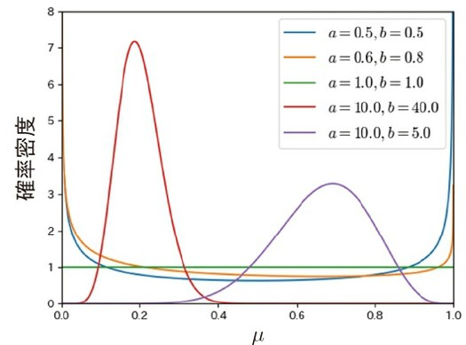
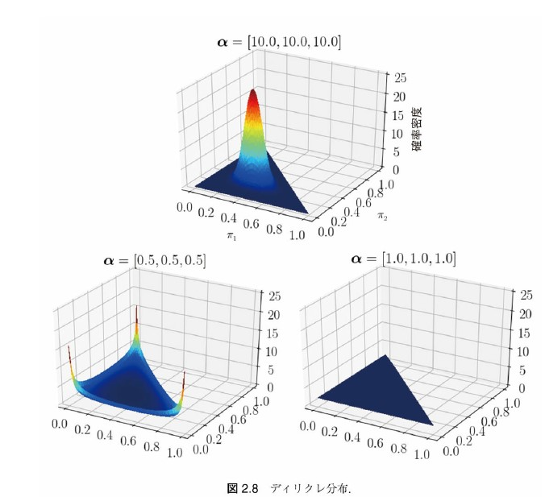
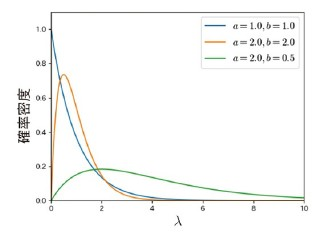
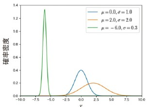
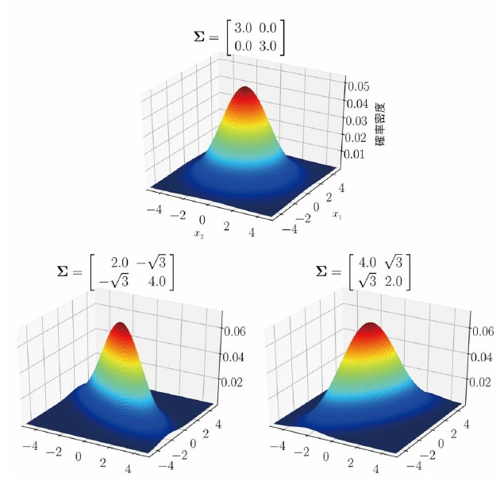

<!-- _class: first -->

# 「ベイズ推論による機械学習」勉強会 (3)

## 第 2 章: 連続型確率分布 / 第 3 章: ベイズ推論による学習と予測

### 正好 奏斗(@cosnomi)

---

## 前回までに学んだこと

- 離散型・連続型確率分布の期待値・エントロピー
- ベイズの定理
- 離散型確率分布
  - ベルヌーイ分布・二項分布・カテゴリ分布・多項分布
  - ポアソン分布
- **連続型確率分布**← 今回はここを掘り下げる
  - ベータ分布
- **簡単なベイズ推論の流れ**← 今回はここを掘り下げる

---

## 今後の展望

- 離散型・連続型確率分布の性質を理解する ←**済** + 今回やる
  - 実際のデータに対して良さげな分布を取れる
- 共役事前分布を用いたベイズ推論を学ぶ ← **今回やる**
  - きれいなデータに対して、ベイズ推論が可能になる
  - 「共役な事前分布を仮定できるデータ」に対してという意味
- MCMC 法・変分推論を学ぶ
  - 事前分布に色々な分布を取って、近似的に計算できる
- Python を用いてベイズ推論を行う
  - 理論の概略を理解していれば、Python 自体は難しくない

---

<!-- _class: chapter -->

## 連続型確率分布の続き

---

## 連続型確率分布の続き

- ベータ分布
  - 多次元に拡張 → ディリクレ分布
- ガンマ分布
- 1 次元ガウス分布 (正規分布)
  - 多次元に拡張 → 多次元ガウス分布
- ウィシャート分布

---

## 数式は省略していきます

- それぞれの分布の期待値・エントロピー・KL ダイバージェンスの計算は省略していきます。
- 離散型なら計算結果から直感的に納得しやすかった
  - 二項分布の期待値が$np$など
- 連続型になると、それぞれの値について、直感的に納得することが難しい。計算も煩雑。
- それぞれの値の定義・性質を理解して、具体的な値はその都度調べれば良い(と考えます)

---

## ベータ分布

-  パラメータ$a, b \in \mathbb{R}^+$を用いて、$\mu \in (0,1)$を生成する

$$\mathrm{Beta}(\mu|a,b) = C_B(a,b)\mu^{a-1}(1-\mu)^{b-1}$$

- $C_B(a,b)$は 正規化項
  

---

## ディリクレ分布

-  $\mathrm{Dir}(\pi|\alpha) = C_D(\alpha) \prod_{k=1}^K \pi_k^{\alpha_k-1}$
- $\alpha$は K 次元のパラメータで、それぞれの要素は正の実数 $\alpha_k \in \mathbb{R}^+$
- 生成される値($\pi$)は、K 次元ベクトル
  - それぞれの要素は 0 から 1 の間、総和を取ると 1(確率の性質)
    

---

## ガンマ分布

-  $\mathrm{Gam}(\lambda | a,b) = C_G(a,b)\lambda^{a-1}e^{-b\lambda}$
- 生成される値 $\lambda \in \mathbb{R}^+$
- パラメータ$a,b \in \mathbb{R}^+$
  

---

## 一次元ガウス分布

- 「正規分布」と呼ばれ、色々なデータがこの分布に従う
- $N(x|\mu, \sigma^2)=\frac{1}{\sqrt{2\pi \sigma^2}} \exp\left(-\frac{(x-\mu)^2}{2\sigma^2} \right)$
- $x \in \mathbb{R}, \mu \in \mathbb{R}, \sigma^2 \in \mathbb{R}^+$
- 対数を取ると、$\ln N(x|\mu, \sigma^2)=-\frac{1}{2}(\frac{(x-\mu)^2}{2 \sigma^2} + \ln \sigma^2 + \ln 2\pi)$
  - 対数をとった形も大事 (指数が降りて簡単になる)
  - エントロピーや KL ダイバージェンスの式では分布の log を取るので

---

## 一次元ガウス分布

- 平均: $\langle x \rangle = \mu$
- 分散: $\langle (x-\mu)^2 \rangle = \sigma^2$

---

## 多次元ガウス分布

$$N(\bm{x}|\bm{\mu}, \Sigma) = \frac{1}{\sqrt{(2\pi)^D \det \Sigma}} \exp \left( -\frac{1}{2}(\bm{x}-\bm{\mu})^T \Sigma^{-1} (\bm{x}-\bm{\mu}) \right)$$

- 生成される値: $\bm{x}\in \mathbb{R}^D$
- パラメータ: $\bm{\mu} \in \mathbb{R}^D, \Sigma \in \mathbb{R}^{D\times D}$
  - 分散を表していた$\sigma^2$の部分が、ベクトルではなく行列$\Sigma$に
  - $\Sigma$は共分散行列($\Sigma_{ij}=\sigma_{ij}$)
    - 対角成分が分散、それ以外は他の値との関係(共分散)を表す
    - 対角成分以外が 0 なら各変数は独立している

---

## 多次元ガウス分布

---

## ウィシャート分布

- D\*D の正定値行列$\Lambda$を生成する分布
  $$W(\Lambda | v, W)=C_W(v,W)|\Lambda|^{\frac{v-D-1}{2}}\exp\left(-\frac{1}{2}\mathrm{Tr} (W^{-1}\Lambda) \right)$$
- パラメータ: $v \in \mathbb{R} (v > D-1)$: 自由度, $W \in \mathbb{R}^{D\times D}$
- 多次元ガウス分布$N(0, \Sigma)$に従う n 個の p 次元ベクトル$\bm{x}_1, \dots \bm{x}_n$について、$\Lambda=\sum_i \bm{x}_i \bm{x}_i^T$は$W(\Lambda | n, \Sigma)$に従う

  - 多次元ガウス分布のパラメータに使える
  - そのままではなく、逆行列$\Lambda^{-1}$を$\Sigma$として使う

---

<!-- _class: chapter -->

## ベイズ推論の流れ

---

## 同時分布を考えて分解する

- まずは具体的な分布ではなく、抽象的に考える
- 登場する変数は
  - $D$: 訓練データ
  - $\theta$: パラメータ
  - $x_*$: 未観測のデータ

---

## 未観測のデータって何？入力データはどこに入るの？

- NN では入力データ(検査値など)があって、それに対して出力(陽性・陰性など)を出力する
  - ロジスティック回帰とかもそれ $\bm{x} \longrightarrow y$
  - が、別にそれだけが機械学習ではない
- 今扱っているのは、データを受け取って、それ自体が取る分布を推測するタイプ
  - $\bm{x}$そのものが取る分布はどんな形？期待値は？分散は？ ~~調べてみました！~~

---

## 同時分布を考えて分解する

- 同時分布 $p(D, \theta, x_*)$
- $p(D|\theta)p(x_*|\theta)p(\theta)$のように分解
  - これは数式処理ではなく、このように仮定できるよねという意味
  - 訓練データと未知のデータは、パラメータに依存している
  - パラメータのもとで、訓練データと未知のデータは条件付き独立

---

## ベイズの定理を使う

- $p(D|\theta)$って何だろう？
  - 「パラメータ$\theta$が与えられたときに、訓練データが$D$に等しくなる確率」
  - 普通は逆で、訓練データを与えたときにパラメータの分布を求めたいのでは？→$p(\theta|D)$のほうが扱いやすい!
- ベイズの定理より、$p(D|\theta) = p(\theta|D)p(D) / p(\theta)$
- 代入して、
  $$\begin{aligned}p(x_*, \theta, D) &=p(D|\theta)p(x_*|\theta)p(\theta) \\ &=p(\theta|D)p(D)p(x_*|\theta)\end{aligned}$$

---

## 予測分布

- 今、訓練データ D だけが手元にあるので、$p(x_*, \theta | D)$を求めたい
- 先程の式に D を条件として入れると右辺の p(D) が消える
  - $p(x_*, \theta | D)=p(x_*|\theta)p(\theta|D)$
- 予測として求めたいのは、$p(x_* | \theta, D)$の分布
- $\theta$について周辺化してあげたのが、**予測分布**
  $$p(x_* | \theta, D) = \int p(x_* | \theta) p(\theta | D) d\theta$$
- 次は$p(\theta | D)$に注目する

---

## 事前分布・事後分布 (復習)

- どちらも、**パラメータ$\theta$の分布**
- 違いは「訓練データを見る**前**」or「見た**後**」
  - 事前分布: $p(\theta)$
  - 事後分布: $p(\theta | D)$
- 通常、訓練というのは、「事後分布を求めること」
  - どうやって？→ ベイズの定理を用いる(復習)
  - $p(\theta|D) = p(D|\theta)p(\theta) / p(D)$
