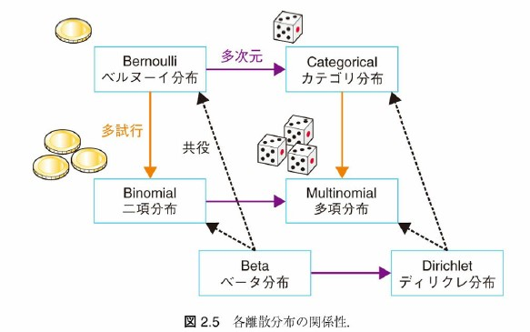
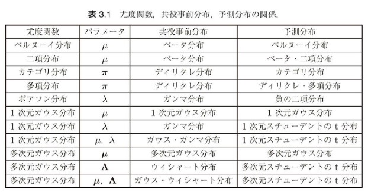
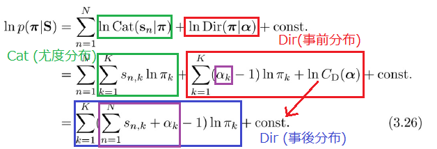
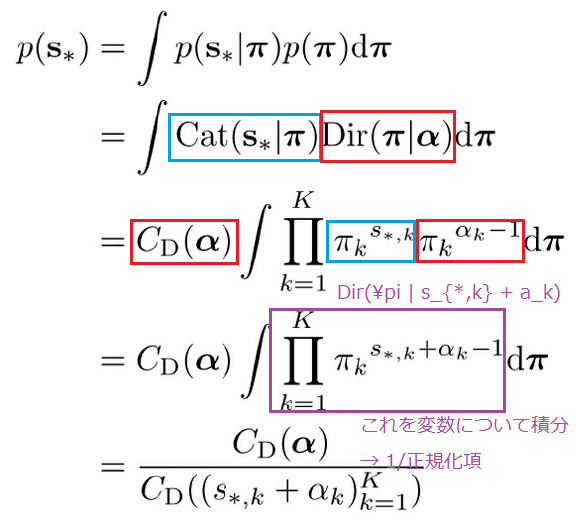
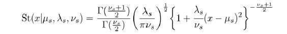
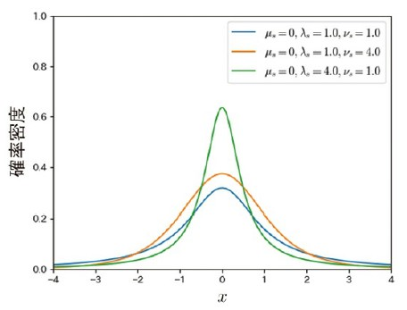
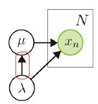
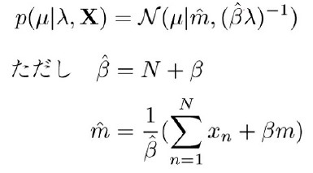
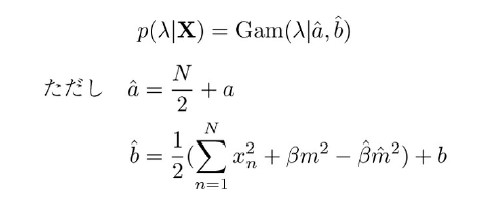
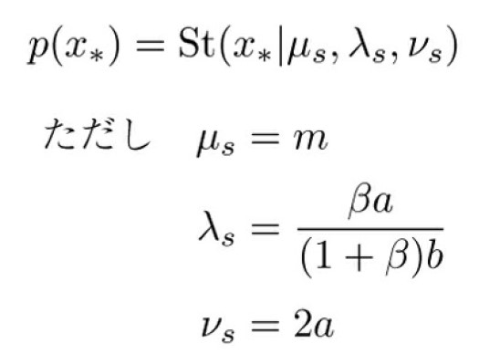

<!-- _class: first -->

# 「ベイズ推論による機械学習」勉強会 (3)

## 第 2 章: 連続型確率分布 / 第 3 章: ベイズ推論による学習と予測

### 正好 奏斗(@cosnomi)

---

## 前回までに学んだこと

- 離散型・連続型確率分布の期待値・エントロピー
- ベイズの定理
- 離散型確率分布
  - ベルヌーイ分布・二項分布・カテゴリ分布・多項分布
  - ポアソン分布
- **連続型確率分布**← 今回はここを掘り下げる
  - ベータ分布
- **簡単なベイズ推論の流れ**← 今回はここを掘り下げる

---

## 今後の展望

- 離散型・連続型確率分布の性質を理解する ←**済** + 今回やる
  - 実際のデータに仮定する分布を選択できる
- 共役事前分布を用いたベイズ推論を学ぶ ← **今回やる**
  - ベイズ推論の基本原理を理解する
- MCMC 法・変分推論を学ぶ
  - 複雑なモデルを構築し、近似的に計算できる
- Python を用いてベイズ推論(MCMC 法・変分ベイズ)を行う
  - 理論の概略を理解していれば、Python 自体は難しくない

---

<!-- _class: chapter -->

## 連続型確率分布の続き

---

## 連続型確率分布の続き

- ベータ分布
  - 多次元に拡張 → ディリクレ分布
- ガンマ分布
- 1 次元ガウス分布 (正規分布)
  - 多次元に拡張 → 多次元ガウス分布
- ウィシャート分布

---

## 数式は省略していきます

- それぞれの分布の期待値・エントロピー・KL ダイバージェンスの計算は省略していきます

  なぜ？

- 離散型なら計算結果から直感的に納得しやすかった
  - 二項分布の期待値が$np$など
- 連続型になると、それぞれの値について、直感的に納得することが難しい。計算も煩雑。
- それぞれの値の定義・性質を理解して、具体的な値はその都度調べれば良い(と考えます)

---

## ベータ分布

-  パラメータ$a, b \in \mathbb{R}^+$を用いて、$\mu \in (0,1)$を生成する

$$\mathrm{Beta}(\mu|a,b) = C_B(a,b)\mu^{a-1}(1-\mu)^{b-1}$$

- $C_B(a,b)$は 正規化項
  

---

## ディリクレ分布

-  $\mathrm{Dir}(\pi|\alpha) = C_D(\alpha) \prod_{k=1}^K \pi_k^{\alpha_k-1}$
- $\alpha$は K 次元のパラメータで、それぞれの要素は正の実数 $\alpha_k \in \mathbb{R}^+$
- 生成される値($\pi$)は、K 次元ベクトル
  - それぞれの要素は 0 から 1 の間、総和を取ると 1(確率の性質)
    

---

## 分布同士の関係

---

## ガンマ分布

-  $\mathrm{Gam}(\lambda | a,b) = C_G(a,b)\lambda^{a-1}e^{-b\lambda}$
- 生成される値 $\lambda \in \mathbb{R}^+$
- パラメータ$a,b \in \mathbb{R}^+$
  

---

## 一次元ガウス分布

- 「正規分布」と呼ばれ、色々なデータがこの分布に従う
- $N(x|\mu, \sigma^2)=\frac{1}{\sqrt{2\pi \sigma^2}} \exp\left(-\frac{(x-\mu)^2}{2\sigma^2} \right)$
- $x \in \mathbb{R}, \mu \in \mathbb{R}, \sigma^2 \in \mathbb{R}^+$
- 対数を取ると、$\ln N(x|\mu, \sigma^2)=-\frac{1}{2}(\frac{(x-\mu)^2}{2 \sigma^2} + \ln \sigma^2 + \ln 2\pi)$
  - 対数をとった形も大事 (指数が降りて簡単になる)
  - エントロピーや KL ダイバージェンスの式では分布の log を取るので

---

## 一次元ガウス分布

- 平均: $\langle x \rangle = \mu$
- 分散: $\langle (x-\mu)^2 \rangle = \sigma^2$

---

## 多次元ガウス分布

$$N(\bm{x}|\bm{\mu}, \Sigma) = \frac{1}{\sqrt{(2\pi)^D \det \Sigma}} \exp \left( -\frac{1}{2}(\bm{x}-\bm{\mu})^T \Sigma^{-1} (\bm{x}-\bm{\mu}) \right)$$

- 生成される値: $\bm{x}\in \mathbb{R}^D$
- パラメータ: $\bm{\mu} \in \mathbb{R}^D, \Sigma \in \mathbb{R}^{D\times D}$
  - 分散を表していた$\sigma^2$の部分が、ベクトルではなく行列$\Sigma$に
  - $\Sigma$は共分散行列($\Sigma_{ij}=\sigma_{ij}$)
    - 対角成分が分散、それ以外は他の値との関係(共分散)を表す
    - 対角成分以外が 0 なら各変数は独立している

---

## 多次元ガウス分布

---

## ウィシャート分布

- D\*D の正定値行列$\Lambda$を生成する分布
  $$W(\Lambda | v, W)=C_W(v,W)|\Lambda|^{\frac{v-D-1}{2}}\exp\left(-\frac{1}{2}\mathrm{Tr} (W^{-1}\Lambda) \right)$$
- パラメータ: $v \in \mathbb{R} (v > D-1)$: 自由度, $W \in \mathbb{R}^{D\times D}$
- 多次元ガウス分布$N(0, \Sigma)$に従う n 個の p 次元ベクトル$\bm{x}_1, \dots \bm{x}_n$について、$\Lambda=\sum_i \bm{x}_i \bm{x}_i^T$は$W(\Lambda | n, \Sigma)$に従う

  - 多次元ガウス分布のパラメータに使える
  - そのままではなく、逆行列$\Lambda^{-1}$を$\Sigma$として使う

---

<!-- _class: chapter -->

## ベイズ推論の流れ

---

## 同時分布を考えて分解する

- まずは具体的な分布ではなく、抽象的に考える
- 登場する変数は
  - $D$: 訓練データ
  - $\theta$: パラメータ
  - $x_*$: 未観測のデータ

---

## 未観測のデータって何？入力データはどこに入るの？

- NN では入力データ(検査値など)があって、それに対して出力(陽性・陰性など)を出力する
  - ロジスティック回帰とかもそれ $\bm{x} \longrightarrow y$
  - が、別にそれだけが機械学習ではない
- 今扱っているのは、データを受け取って、それ自体が取る分布を推測するタイプ
  - $\bm{x}$そのものが取る分布はどんな形？期待値は？分散は？ ~~調べてみました！~~

---

## 同時分布を考えて分解する

- 同時分布 $p(D, \theta, x_*)$
- $p(D|\theta)p(x_*|\theta)p(\theta)$のように分解
  - これは数式処理ではなく、このように仮定できるよねという意味
  - 訓練データと未知のデータは、パラメータに依存している
  - パラメータのもとで、訓練データと未知のデータは条件付き独立

---

## ベイズの定理を使う

- $p(D|\theta)$って何だろう？
  - 「パラメータ$\theta$が与えられたときに、訓練データが$D$に等しくなる確率」
  - 普通は逆で、訓練データを与えたときにパラメータの分布を求めたいのでは？→$p(\theta|D)$のほうが扱いやすい!
- ベイズの定理より、$p(D|\theta) = p(\theta|D)p(D) / p(\theta)$
- 代入して、
  $$\begin{aligned}p(x_*, \theta, D) &=p(D|\theta)p(x_*|\theta)p(\theta) \\ &=p(\theta|D)p(D)p(x_*|\theta)\end{aligned}$$

---

## 予測分布

- 今、訓練データ D だけが手元にあるので、$p(x_*, \theta | D)$を求めたい
- 先程の式に D を条件として入れると右辺の p(D) が消える
  - $p(x_*, \theta | D)=p(x_*|\theta)p(\theta|D)$
- 予測として求めたいのは、$p(x_* | \theta, D)$の分布
- $\theta$について周辺化してあげたのが、**予測分布**
  $$p(x_* | \theta, D) = \int p(x_* | \theta) p(\theta | D) d\theta$$
- 次は$p(\theta | D)$に注目する

---

## 事前分布・事後分布 (復習)

- どちらも、**パラメータ$\theta$の分布**
- 違いは「訓練データを見る**前**」or「見た**後**」
  - 事前分布: $p(\theta)$
  - 事後分布: $p(\theta | D)$
- 通常、訓練というのは、「事後分布を求めること」
  - どうやって？→ ベイズの定理を用いる(復習)
  - $p(\theta|D) = p(D|\theta)p(\theta) / p(D)$

---

## 共役事前分布

- 事前分布の一種
- 事後分布が同じ形(パラメータは異なるかもだけど)になる
- $p(\theta|D) = p(D|\theta)p(\theta) / p(D)$なので、尤度分布$p(D|\theta)$をどのように決めるかで異なる
  

---

## 共役事前分布の利点と限界

- 事前と事後が同じ分布だったら計算しやすい
- 逐次的に計算できる
  - $p(\theta|D_1)$と$p(\theta)$の違いはパラメータだけなので、新しいデータ$D_2$が追加されたときは同様に、$p(\theta|D_1,D_2)$を計算できる
- 限界: 複雑なデータには共役事前分布が合わないときがある
- まずは共役事前分布を用いた推論を学び、その後、より複雑なモデルで共役でない事前分布を用いた推論を学ぶ

---

<!-- _class: chapter -->

## カテゴリ分布の学習と予測

---

## 仮定

- サイコロのように K 個(K=6)の結果が起こる試行の結果: $\bm{s} \in \mathbb{R}^K$
- これがカテゴリ分布に従う: $p(\bm{s}|\bm{\pi})=\mathrm{Cat}(\bm{s}|\bm{\pi})$
- 今、手元には$N$回サイコロを振って目を記録した訓練用データ$S=\{s_1,\dots ,s_N\}$がある
- これを用いて、今から出る目$\bm{s}_*$の分布を予測したい

---

## 事前分布

- カテゴリ分布のパラメータ$\pi \in \mathbb{R}^K$は$\sum_i \pi_k=1$かつ$\pi_k \in (0,1)$
- ディリクレ分布が良さそう$p(\pi) = \mathrm{Dir}(\bm{\pi} | \bm{\alpha})$
  - これは共役事前分布
  - 実際に計算して、確かめてみる

---

## ディリクレ分布はカテゴリ分布の共役事前分布

- 主張したいこと: $p(\bm{\pi}|S)$はディリクレ分布
- ベイズの定理より
  $$p(\bm{\pi}|S)\propto p(S|\bm{\pi})p(\bm{\pi})=(\prod_n \mathrm{Cat}(s_n|\pi))\mathrm{Dir}(\pi|\alpha)$$

---

よって、
$p(\bm{\pi}|S) = \mathrm{Dir}(\bm{\pi} | \hat{\bm{\alpha}})$
新しいパラメータ$\hat{{\alpha}_k}=\sum_n s_{n,k} + \alpha_k$

### Oh... that's so cool :sunglasses:

---

## 予測分布の計算

- 学習前の予測分布を計算してみる

---

- 正規化項を戻すと複雑な式が出てくる
- が、$\bm{s_*}$は one-hot ベクトルだったことを思い出すと、必要なのは各要素が 1 になるときだけ
- $p(s{*, k'} = 1) = \frac{\alpha_{k'}}{\sum_{k=1}^{K}\alpha_k}$
- カテゴリ分布で書き直すと、
  $$ p(\bm{s_*}) = \mathrm{Cat}(\bm{s_*} | \left(\frac{\alpha_k}{\sum_{i=1}^K \alpha_i}\right)_{k=1}^K )$$
- 学習後の予測分布には事後分布を用いる
- 事後分布はパラメータが変わるだけ$\bm{\alpha} \rightarrow \hat \bm{\alpha}$

---

## ハイパーパラメータの役割

- $\bm{\alpha}=(1,1,1,1)$のとき
  - 学習前はどの目も均等(1/4)に出ると予測
  - 今、6 回振ってそれぞれ、3, 1, 1, 1 回出たとする
  - $\hat{\bm{\alpha}} = (4,2,2,2)$となる
  - 予測分布のパラメータは$(0.4, 0.2, 0.2, 0.2)$
- $\bm{\alpha}=(1000,1000,1000,1000)$のとき
  - 学習前はどの目も均等(1/4)に出ると予測
  - $\hat{\bm{\alpha}} = (1003,1001,1001,1001)$となる
  - 予測分布のパラメータは$(0.2503, 0.2498, 0.2498, 0.2498)$

---

- 事前分布(今回の場合は特にパラメータ)に知識を埋め込める

  - $\bm{\alpha}=(1,1,1,1)$
    - このサイコロの目は均等に出るはずなんだけど結構偏る
  - $\bm{\alpha}=(1000,1000,1000,1000)$
    - このサイコロの目は高い精度で均等に出る

- たくさんのデータを学習させれば、行き着くところは同じ
  - $\bm{\alpha}$のオーダーが$10^3$でも、訓練データの試行回数が$10^9$とかなら些細な違い

---

<!-- _class: chapter -->

## ポアソン分布の学習と予測

---

- やるべきことは、前と同じ(実際の計算が違うだけ)なので、サクッと
- $p(x|\lambda) = \mathrm{Poi}(x|\lambda)$ (尤度分布)
- $\lambda \in \mathbb{R}^+$で、共役事前分布はガンマ分布
- $p(\lambda) = \mathrm{Gam}(\lambda | a,b)$とする (事前分布)

---

## 事後分布

- $X=\{x_1, \dots , x_N\}$を学習したとき、事後分布は？
- 計算省略
- $p(\lambda | X) = \mathrm{Gam}(\lambda | \hat{a}, \hat{b})$
- $\hat{a}=\sum_n x_n+a$
- $\hat{b}=\N+b$

---

## 予測分布

- $\int \mathrm{Poi}(x_*|\lambda) \mathrm{Gam}(\lambda | \hat{a}, \hat{b}) d\lambda$
- 計算省略
- 得られる分布は負の二項分布 $\mathrm{NB}(x_* | r, p)$
- $r=\hat{a}, p = \frac{1}{\hat{b}+1}$
- **NOTE**: 尤度分布と予測分布は同じではない
  - 尤度分布にポアソン分布を仮定したけど、それはパラメータ$\lambda$を固定したときの分布
  - 予測分布はパラメータについて積分(周辺化)するので、パラメータ自体の分布のせいで異なる形の分布になることはある

---

<!-- _class: chapter -->

## 1 次元ガウス分布の学習と予測

---

## 何を学習するのか

- ガウス分布にはパラメータが 2 つ ($\mu, \sigma^2$)あるので、何を学習するのかは 3 パターンある
  - データがガウス分布に従うと仮定できるけど、
  1. 平均は分からないが、分散は分かる
  2. 分散は分からないが、平均は分かる
  3. どちらも分からない
- NOTE: これ以降、数式の表記上、$\sigma^2$の代わりに、精度パラメータ$\lambda = \frac{1}{\sigma^2}$を用いる。$\lambda$が大きいほど、平均付近にまとまった分布になる

---

<!-- _class: chapter -->

## 平均のみが未知の場合

---

## 事前分布

- まずベースとなるガウス分布 $p(x|\mu) = N(x|\mu, \lambda^{-1})$
- やりたいこと: この$\mu$に事前分布を決め、いくつかサンプルした$x$(訓練データ)から、$x$の事後分布を求めたい
- 今回は、$p(\mu) = N(\mu | m, \lambda_{\mu}^{-1})$を事前分布とする
  - $m$と$\lambda_{\mu}^{-1}$はハイパーパラメータ
    - 尤度分布の$\lambda$とは違う
  - これは共役事前分布である
- 平均のみが未知のときはこれが共役になるが、推定したいパラメータが異なれば、事前分布も異なってくる

---

## 事後分布の計算

$p(\mu|X) \propto p(X | \mu) p(\mu) = \{\prod_n N(x_n | \mu, \lambda^{-1})\}N(\mu | m, \lambda_{\mu}^{-1})$

- ここからは正規分布の対数をとって計算する (省略します！)
- 結果として、次のようなパラメータをもつガウス分布を得る

  - $\hat{\lambda_\mu} = N\lambda + \lambda_{\mu}$
  - $\hat{m} = \frac{\lambda \sum_n x_n + \lambda_{\mu} m}{\hat{\lambda}_\mu}$

- 定性的に何が言える？
  - 平均の精度は N が増えるほど高くなる
  - $\hat{m}$は N が増えるほど、$\lambda \sum_n x_n$が重くなってくる ($\lambda_\mu m$より)

---

## 予測分布

$p(x_* | X) = \int p(x_* | \mu, \lambda^{-1})p(\mu | X) d\mu$

- 込み入った計算になるので省略
- 結果として得られる分布は$p(x_* | X) = N(x_* | \mu_*, \lambda_*^{-1})$
  - $\lambda_*=\frac{\lambda \hat{\lambda}_\mu}{\lambda + \hat{\lambda}_\mu}$
    - $N$が非常に大きければ、$\hat{\lambda}_\mu \approx N\lambda$
    - このとき、$\lambda_* = \lambda$ (精度はほぼ変わらないということ)
  - $\mu_* = \hat{m}$

---

## スピードアップ

ここからは今までよりもさらに雑に追っていきます

なぜ？

- 詳しい計算なら本にしっかり載っている
- 早く MCMC 法あたりまで進んで実際にコードを書いていきたい

---

<!-- _class: chapter -->

## 精度のみが未知の場合

---

## 事前分布

- まずベースとなるガウス分布 $p(x|\lambda) = N(x|\mu, \lambda^{-1})$
- やりたいこと: この$\lambda$(← ここが違う)に事前分布を決め、いくつかサンプルした$x$(訓練データ)から、$x$の事後分布を求めたい
- 今回は、$p(\lambda)=\mathrm{Gam}(\lambda | a,b)$を事前分布とする
  - $a,b$はハイパーパラメータ
  - この分布は正の実数値を生成する ($\lambda$の性質を満たす)
  - これは共役事前分布である

---

- 事後分布 $p(\lambda | X) = \mathrm{Gam}(\lambda | \hat{a}, \hat{b})$

  - $\hat{a} = N/2 + a$, $\hat{b} = 1/2 \sum_n (x_n-\mu)^2 + b$

  

- 予測分布
  - スチューデントの t 分布を用いる
    
    
  - 明らかに関わっちゃいけないタイプの式なんですが、これ、みなさん(私含む)レポートでよく使ってたんですよね。
  - これを用いて、$p(x_*) = \mathrm{St}(x_*|\mu_s, \lambda_s,\nu_s$)
  - $\mu_s=\mu, \lambda_s =a/b, \nu_s=2a$

---

<!-- _class: chapter -->

## 平均・精度が未知の場合

---

## 事前分布

- 尤度分布の設定 $p(x|\mu, \lambda) = N(x|\mu, \lambda^{-1})$
- 共役事前分布 $p(\mu, \lambda) = \mathrm{NG}(\mu, \lambda | m \beta, a, b)$
  - $\mathrm{NG}$はガウス・ガンマ分布
  - $N(\mu|m, (\beta \lambda)^{-1})\mathrm{Gam}(\lambda|a,b)$
- 今まで通り、計算は省略する部分が多いんですが、今回は予測する変数が 2 つ($\mu, \lambda$)なのは注意してみていきたいです。

- 平均パラメータが精度パラメータに依存している

---

- まず、平均の方は$\lambda$を決めてしまえば、前と同じ
  
- 基本に戻って、同時分布の構築
  - $p(X, \mu, \lambda) = p(\mu|\lambda, X) p(\lambda|X)p(X)$
    
    

---

## 予測分布

$$p(x_* | X) = \iint p(x_* | \mu, \lambda) p(\mu, \lambda | X) \ d\mu d\lambda$$

- 結局、パラメータが取りうるすべての値について積分することは変わらない
  

---

##
